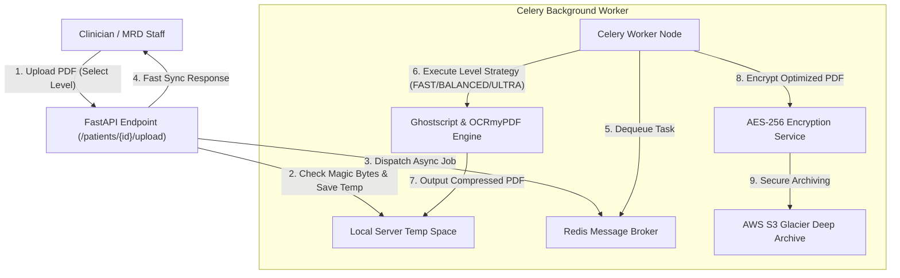

# Digifort Labs - Advanced PDF Optimization Engine

The Advanced PDF Optimization Engine is a highly optimized, scalable, secure, and asynchronous pipeline designed to ingest, downsample, compress, encrypt, and securely serve medical documents and scan files. It provides three tailored compression levels, background worker concurrency, and military-grade encryption prior to cloud S3 archiving.

---

## 1. Engine Architecture

The architecture utilizes a decoupled asynchronous processing pipeline powered by **FastAPI** (API boundary), **Celery** (background workers), **Redis** (message broker), and a **Local/S3 storage layer**.



---

## 2. Multi-Level Compression System

The engine supports four compression strategies, exposing optimal trade-offs between processing speed and file size reduction:

| Strategy | Technology | Best Used For | Typical Size Reduction | Target DPI |
| :--- | :--- | :--- | :--- | :--- |
| **FAST** | Ghostscript (Pre-set screen downsampling) | High-speed, standard scanning, draft storage. | ~40% - 60% | 72 DPI |
| **BALANCED** | Ghostscript (Pre-set ebook downsampling) | Daily clinical operations, high readability, active medical records. | ~60% - 80% | 150 DPI |
| **ULTRA** | OCRmyPDF + Ghostscript + JBIG2 encoder | Long-term archiving, monochrome scans, massive storage consolidation. | ~80% - 95% | 300 DPI (Max JBIG2) |
| **NONE** | Pass-through (No downsampling) | High-fidelity laboratory reports, diagnostic imaging, pathology records. | 0% (Original intact) | Source |

### Strategy Implementation Detail

- **FAST**: Uses Ghostscript with `/screen` presets. Fastest execution time (<2 seconds on typical PDFs). Ideal for low-memory environments.
- **BALANCED**: Uses Ghostscript with `/ebook` presets. Perfectly balances visual quality and high-density compression (text remains extremely sharp, images are downsampled to 150 DPI).
- **ULTRA**: Runs a parallel high-density monochrome compression routine. Incorporates JBIG2 encoder, stripping redundant fonts and running ocrmypdf with text layer optimization. Great for scans.
- **NONE**: Skips optimization entirely, routing the raw uploaded bytes directly to the encryption and indexing pipelines.

---

## 3. Core API Endpoints

### 1. Document Upload
- **URL**: `POST /api/patients/{patient_id}/upload`
- **Content-Type**: `multipart/form-data`
- **Request Body**:
  - `file`: UploadFile (PDF or Video)
  - `compression_level`: Form parameter string (`FAST` \| `BALANCED` \| `ULTRA` \| `NONE`)
- **Response**:
  ```json
  {
    "status": "processing",
    "file_id": 481,
    "message": "Upload accepted and confirmed, processing in background."
  }
  ```

### 2. Check Job Status
- **URL**: `GET /api/optimization/status/{task_id}`
- **Response**:
  ```json
  {
    "status": "SUCCESS",
    "result": {
      "original_size": 2273022,
      "optimized_size": 483120,
      "compression_ratio": 78.75,
      "path": "backend/data/temp/optimized_test_job_12345.pdf"
    }
  }
  ```

### 3. Secure File Retrieval
- **URL**: `GET /api/optimization/download/{job_id}/{filename}`
- **Security Guardrails**:
  - **Path Traversal Protection**: Enforces path sanitization, raising `403 Forbidden` if request parameters contain `..` or illegal folder navigation operators.
  - **Dynamic Fallback**: If the original temp source file has been recycled by the cleanup task, the router automatically fails over to retrieve from the `optimized_` persistence prefix or requests S3 Glacier restoration.

---

## 4. Security & Compliance Guardrails

1. **Magic Bytes Validation**: The engine inspects the file's binary header (first 1MB chunk) to verify the magic bytes (e.g., `%PDF-` for PDFs) prior to processing. This prevents file extension spoofing attacks.
2. **Encrypted Temp Storage**: Once optimized, files are immediately encrypted using **AES-256 (GCM)** inside the background thread. Non-encrypted temp files are strictly scrubbed post-commit.
3. **Automated Folder Cleanups**: A background maintenance runner (`cleanup_temp_jobs`) executes every 24 hours to securely wipe temporary optimization workspaces exceeding 24 hours in age.

---

## 5. Usage Guidelines

### Upload File using cURL
```bash
curl -X 'POST' \
  'https://api.digifortlabs.com/patients/12/upload' \
  -H 'accept: application/json' \
  -H 'Content-Type: multipart/form-data' \
  -F 'file=@clinical_report.pdf;type=application/pdf' \
  -F 'compression_level=BALANCED'
```

### Frontend Integration (React/TypeScript)
```typescript
const uploadSingleFile = (file: File, level: 'FAST' | 'BALANCED' | 'ULTRA' | 'NONE') => {
  const formData = new FormData();
  formData.append('file', file);
  formData.append('compression_level', level);

  return fetch(`/api/patients/${patientId}/upload`, {
    method: 'POST',
    body: formData,
  }).then(res => res.json());
};
```
