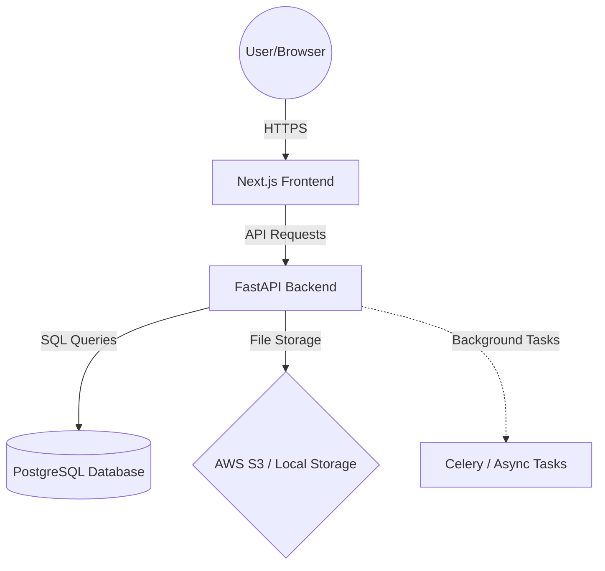
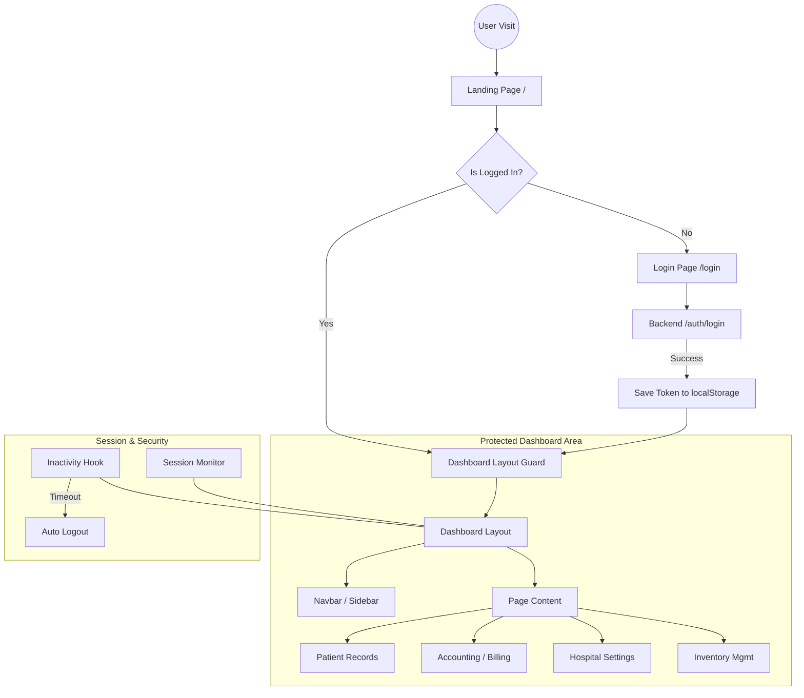
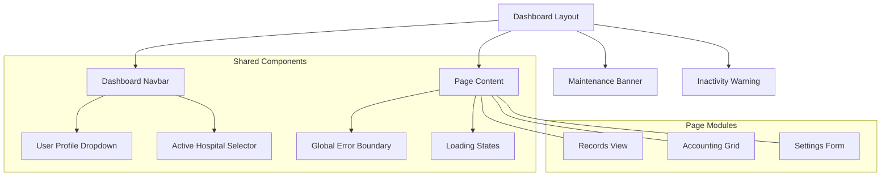
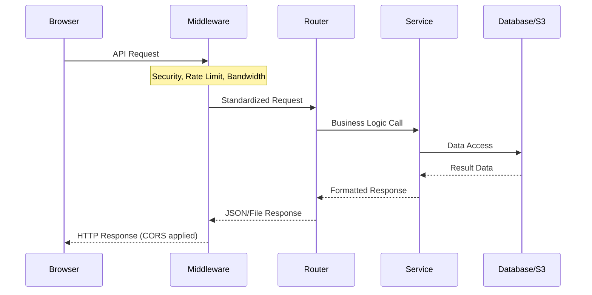
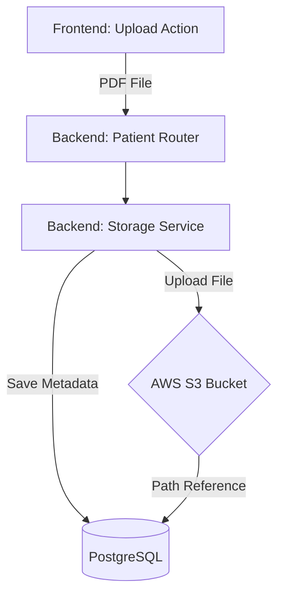

# DIGIFORT LABS - Architecture & Flow Diagrams

This document provides visual representations of the website's frontend and backend systems, their interactions, and data flows.

## 1. High-Level System Architecture

This diagram shows the main components of the system and how they connect.

## 2. Frontend Flow & Navigation

This chart maps the complete user journey from public pages to the protected dashboard.

## 3. Dashboard Component Architecture

How the dashboard UI is structured and shared components are utilized.

## 4. Backend Request Lifecycle

This diagram illustrates how a request is processed by the FastAPI backend.

## 5. Patient Record & Document Flow

The path of patient data and PDF uploads from the UI to storage.

