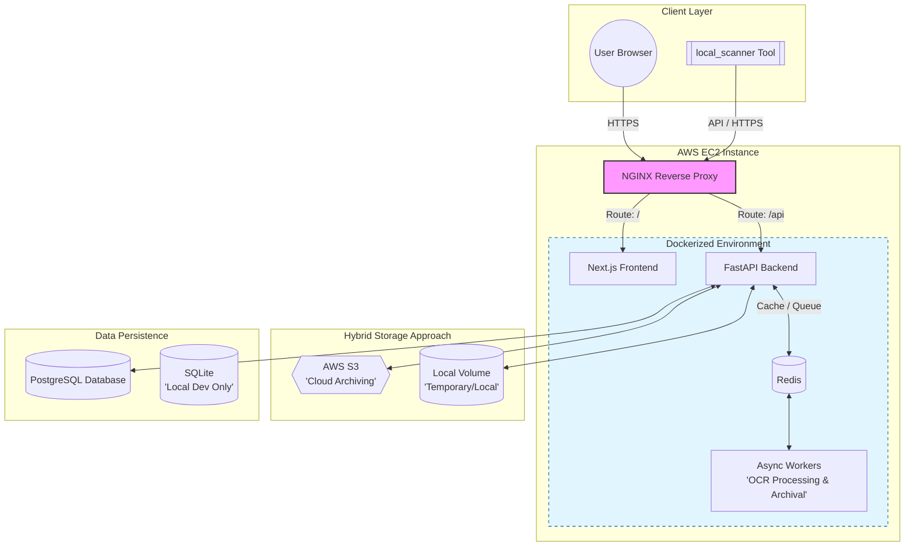
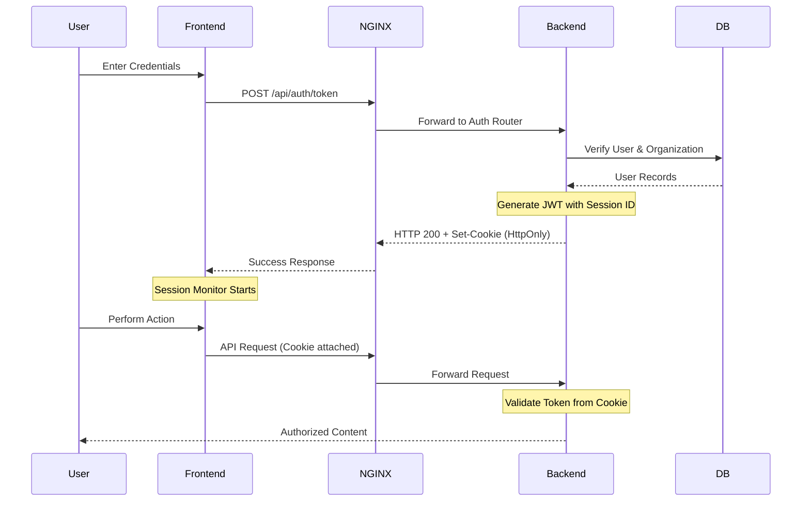
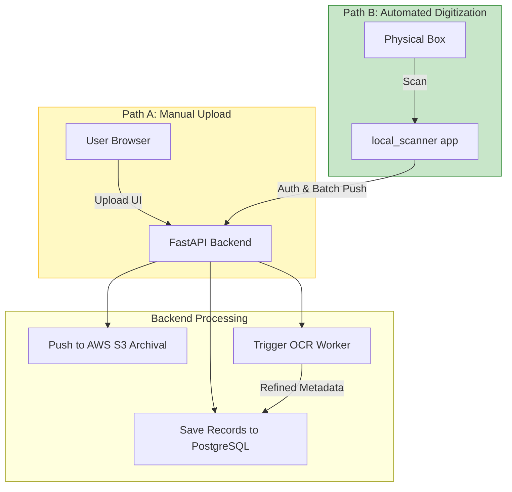
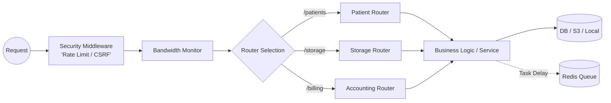

# DigiFort Labs - Architecture & Flow Diagrams

This document providing a comprehensive visual representation of the DigiFort Labs system, its components, security layers, and data life cycles.

## 1. High-Level Infrastructure & System Architecture

This diagram illustrates the production deployment on AWS, featuring containerized services behind a reverse proxy.

## 2. Authentication & Security Flow

Secure session management using HttpOnly Cookies and centralized JWT validation.

## 3. Patient Record & Document Flow

The dual-path upload strategy for manual and automated digitization.

## 4. Backend Request Lifecycle

Internal processing of API requests from middleware to database.

