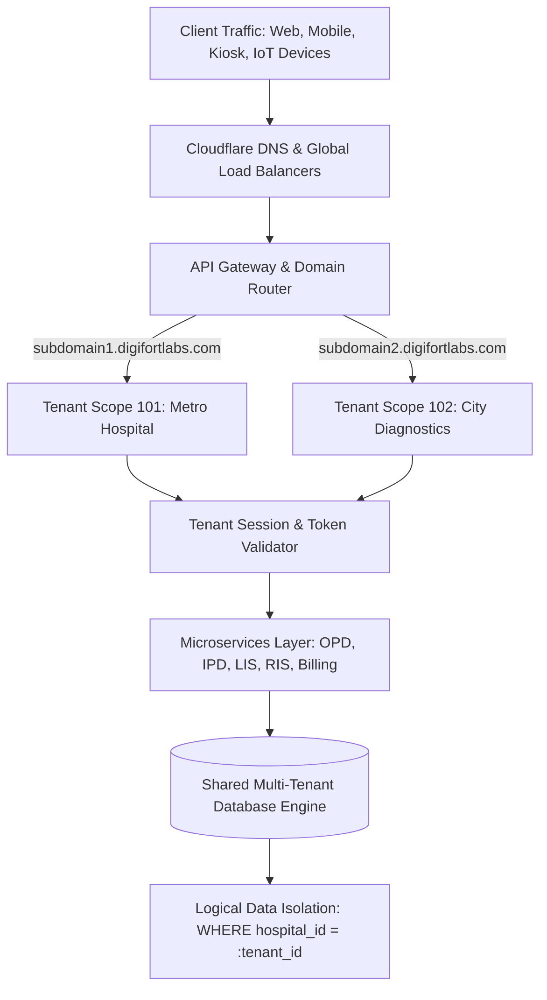
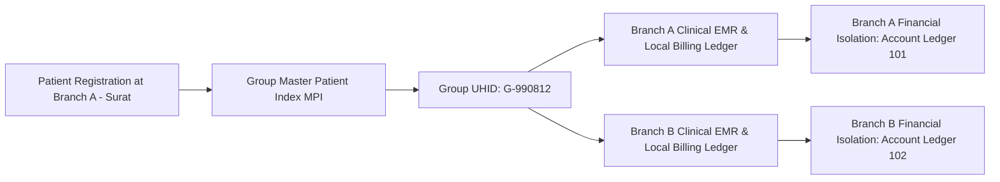

# Chapter 1: Platform Architecture, Multi-Tenancy SaaS & Super Admin Governance

## 1.1 Enterprise Multi-Tenant SaaS Architecture

DigifortLabs HMS is architected as an enterprise-grade, cloud-native Multi-Tenant Software-as-a-Service (SaaS) healthcare engine. Designed to power independent single-specialty clinics, multi-specialty tertiary hospitals, diagnostic chains, and blood banks on a unified cloud infrastructure.

### 1.1.1 Tenant Domain Isolation & Routing Engine
- **DNS Wildcard Subdomain Mapping:** Each customer hospital chain or clinic operates on a dedicated sub-domain (e.g., `apollo-surat.digifortlabs.com` or `care-diagnostics.digifortlabs.com`). Custom white-label domains (e.g., `hms.metrohospital.com`) are fully supported via SSL/TLS reverse proxy mapping.
- **Tenant Context Injection:** The API Gateway resolves incoming HTTP request host headers to an active, validated `hospital_id`. This tenant identity token is injected into every microservice execution context, ensuring that no request can execute across tenant boundaries.

### 1.1.2 Database Multi-Tenancy & Logical Isolation
- **Row-Level Security (RLS):** Every database table across all schemas enforces a mandatory, immutable `hospital_id` foreign key. All dynamic SQL execution engines automatically attach strict filtering parameters (`WHERE hospital_id = :current_tenant`), making accidental cross-tenant data retrieval impossible.
- **Database Schema Partitioning:** For enterprise hospital chains requiring dedicated database schemas, DigifortLabs supports isolated schema provisioning per tenant, providing physical data separation while utilizing shared application compute nodes.

---

## 1.2 Group-Level UHID vs. Branch Financial Isolation

A central architectural challenge in multi-branch hospital networks is balancing clinical care continuity across branches with independent financial accounting. DigifortLabs resolves this through a dual-identity architecture:

### 1.2.1 Group-Level UHID (Master Patient Index - MPI)
- **Unified Medical History:** When a hospital group operates multiple branches across a state or country, a single master patient identity—the **Group UHID**—is established.
- **MPI Matching Algorithm:** Upon patient registration, the system performs a multi-parameter check (Aadhaar / ABHA ID, Mobile Number, Full Name, Date of Birth) against the Group MPI to prevent duplicate UHID creation.
- **Cross-Branch Clinical Accessibility:** When a patient registered at Branch A (Surat) visits Branch B (Vapi), attending doctors at Branch B immediately access their complete clinical history, past discharge summaries, chronic diagnoses, drug allergy records, lab reports, and imaging studies.

### 1.2.2 Branch Financial & Operational Isolation
- **Independent Financial Ledgers:** While clinical data follows the patient, financial accounts remain 100% isolated. Advance deposits made at Branch A cannot be drawn down at Branch B unless explicitly authorized via a corporate inter-branch transfer voucher.
- **Branch Inventory & Bed Isolation:** IPD beds, operating theatre schedules, and pharmacy inventories are strictly locked to the local physical branch. Branch A pharmacy staff cannot issue stock from Branch B's physical pharmacy shelves.

### 1.2.3 Independent Hospital Visiting Doctor Cross-Facility EMR Transfer Workflow
When a visiting physician or consultant treats Patient P at **Hospital A (Independent Tenant 101)** and subsequently calls Patient P to **Hospital B (Unrelated Independent Tenant 102)** for specialized treatment or surgery:
- **Cross-Facility Registration & Legal Isolation:** Hospital B treats Patient P as a **New Registration** in its own local database schema, generating a local Hospital B UHID for independent legal, billing, and tax compliance.
- **Visiting Doctor Account Linkage:** When Dr. Smith logs into Hospital B's HMS workspace, the EMR detects that Dr. Smith holds an active clinical profile across both Hospital A and Hospital B.
- **DPDP Act 2023 Consent-Driven EMR Transfer:** 
  1. Patient P presents their national **ABHA Health ID / QR Code** at Hospital B's front desk or to Dr. Smith.
  2. Patient P receives a 1-time OTP / WhatsApp consent prompt on their mobile device.
  3. Upon digital consent approval, Hospital B's EMR securely pulls Patient P's past clinical encounters, OPD E-Prescriptions, lab diagnostic reports, and PACS imaging studies created at Hospital A via the **ABDM Health Data Exchange Gateway**.
  4. Dr. Smith gains instant 360-degree visibility into Patient P's past medical history without violating multi-tenant database isolation rules between Hospital A and Hospital B.
- **Billing & Registration Fee Customization:** Hospital B's reception desk can apply an automated *"Visiting Doctor Referral Waiver"* to waive local registration fees while generating a fresh, compliant Hospital B invoice for the consultation.

---

## 1.3 30-Role Security Architecture & Multi-Role Assignment Engine

### 1.3.1 Multi-Role Assignment Engine
DigifortLabs HMS supports multi-role account mapping, allowing a single user/employee to be assigned $1$ to $N$ system roles simultaneously:
- **Permission Aggregation:** Active access rights are computed dynamically as the logical OR union of all assigned role capabilities (`Effective Permissions = Role_1 ∪ Role_2 ∪ ... ∪ Role_N`).
- **Contextual Role Switcher:** Dual-role users (e.g., *Attending Consultant* + *Medical Superintendent*) switch workspace views in 1 click from the header menu.

### 1.3.2 11-Module Access Control Matrix
Super Administrators can toggle access to specific functional modules based on the hospital's subscription tier:

| Module Code | Module Description | Target Facility Type | Key Functionality Enabled |
| :--- | :--- | :--- | :--- |
| `MODULE_OPD` | Outpatient Management | Single Clinics & Polyclinics | Registration, e-Rx, Token Queue, WhatsApp Receipts, OPD Billing. |
| `MODULE_IPD` | Inpatient Department | Multi-Specialty Hospitals | Visual Bed Map, Nursing eMAR, HL7 ICU Vitals, Ward Transfers, Discharge. |
| `MODULE_EMERGENCY` | Emergency & Trauma | Emergency Hospitals | ESI 5-Level Triage, Resuscitation Flowsheets, Ambulance GPS Tracking. |
| `MODULE_MATERNITY` | Obstetrics & NICU | Maternity Hospitals | ANC Tracker, WHO Partograph, APGAR Scoring, NICU Incubator Telemetry. |
| `MODULE_IVF` | Fertility & ART | IVF Clinics & Cryo Banks | Surrogacy Act Vault, Follicular Monitoring, Cryo LN2 Tank Inventory. |
| `MODULE_BLOOD_BANK` | Blood Transfusion Bank | Standalone & Hospital Banks | ISBT 128 DIN, 5-TTI Screening, Donor Matrix, Voluntary Camps. |
| `MODULE_CMMS` | Asset Maintenance | Hospitals & Imaging Centers | 7 Equipment Categories, PM Alerts, P1-P4 Breakdown Repair SLAs. |
| `MODULE_LIS` | PathLab Information | Pathology Laboratories | ASTM/HL7 Analyzer Links, Panic Alerts, Westgard QC Charts. |
| `MODULE_RIS_PACS` | Diagnostic Imaging | Radiology Centers | DICOM 3.0 MWL, Web PACS Viewer, Radiologist AI Voice Dictation. |
| `MODULE_OT` | Operation Theatre | Surgical Hospitals | OT Scheduling, PAC Notes, RFID High-Value Implant Tracking. |
| `MODULE_TRIALS` | Clinical Research EMR | Research Hospitals | GCP Consent Vault, Visit Schedules, AE/SAE Auto-Reporting. |

---

## 1.4 Data Privacy, DPDP Act 2023 & Regulatory Compliance

- **Digital Personal Data Protection (DPDP) Act 2023:** Enforces explicit patient consent logging before collecting or sharing demographic and clinical records. Patients retain the right to withdraw consent or request data erasure for non-statutory records.
- **HIPAA Data Security Standards:** Enforces AES-256 bit encryption for all patient data at rest and TLS 1.3 encryption for data in transit across public networks.
- **Immutable Audit Logging:** Logs every user interaction, patient chart view, prescription edit, financial transaction, and record export with timestamp, user ID, role, IP address, and device footprint.

---

## 1.5 Desktop Integration Utilities, Protocol Handlers & Backup Infrastructure

### 1.5.1 Desktop WhatsApp Protocol Sender (`digifort-wa://`)
To eliminate recurring third-party API transaction costs for outpatient prescription delivery and token updates, DigifortLabs HMS includes a local desktop integration protocol:
* **Custom Protocol Handler**: Web application triggers `digifort-wa://` custom URI scheme on client desktop workstations.
* **Local Selenium Automation Daemon** ([`local_wa_sender/`](file:///d:/Website/DIGIFORTLABS/local_wa_sender)): Background Python daemon running on client Windows desktops to format and dispatch WhatsApp Web messages locally via browser automation.

### 1.5.2 Hardware TWAIN Document Scanner Integration
* **Local Scanner Service** ([`local_scanner/`](file:///d:/Website/DIGIFORTLABS/local_scanner)): Windows background daemon listening for hardware scan button events on USB TWAIN scanners and direct WebCam feeds ([`scanner.py`](file:///d:/Website/DIGIFORTLABS/backend/app/routers/scanner.py)).
* **Direct EMR Chart Attachment**: Streams scanned physical medical records directly into patient electronic charts without intermediary file downloads.

### 1.5.3 Standalone Desktop Server Manager GUI
* **Server Control Application** ([`server_manager/`](file:///d:/Website/DIGIFORTLABS/server_manager)): Graphical desktop utility for on-premise IT administrators to monitor local PostgreSQL/SQLite database connections, manage FastAPI server processes, and trigger local manual backups.

### 1.5.4 Dual-Tier AWS S3 Automated Disaster Recovery
* **Automated Encrypted Database Dumps** ([`s3_backup.py`](file:///d:/Website/DIGIFORTLABS/backend/s3_backup.py), [`backup_all.bat`](file:///d:/Website/DIGIFORTLABS/backup_all.bat)): Scheduled background worker creating compressed PostgreSQL `.dump` files.
* **Cloud Storage Sync**: Encrypts and syncs database dumps and patient file attachments (`local_storage/`) to offsite AWS S3 bucket storage for disaster recovery SLA compliance.

