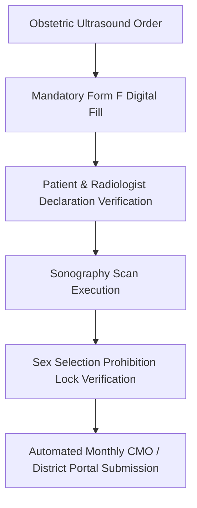

# Chapter 10: PCPNDT Act Compliance & Fetal Diagnostic Register

## 10.1 Pre-Conception & Pre-Natal Diagnostic Techniques (PCPNDT) Act 1994 Governance

The Pre-Conception and Pre-Natal Diagnostic Techniques (PCPNDT) Act 1994 Module enforces strict regulatory compliance across all radiology, obstetric ultrasound, fetal medicine, and genetic diagnostic centers to prevent sex-selective elimination.

### 10.1.1 Mandatory Form F Auto-Filing & Clinical Indication Engine
- **Automated Form F Workflow Trigger:** Every obstetric ultrasound order or fetal procedure requisition on a pregnant patient automatically locks the ultrasound workflow until a statutory **Form F** is completed.
- **Comprehensive Form F Data Fields:**
  - *Patient Demographics:* Full Legal Name, Age, Husband's/Father's Name, Residential Address, Aadhaar/Government Photo ID Number, and Mobile Number.
  - *Obstetric History:* Total Gravida (G), Parity (P), Abortions (A), Living Children (L) with exact male and female child breakdown.
  - *Gestational Timeline:* Last Menstrual Period (LMP) date, Estimated Date of Delivery (EDD), and Gestational Age in weeks ($GA$).
  - *Approved Diagnostic Indications:* Restricts scan justification to legally authorized indications under Section 4(2) of the PCPNDT Act (*e.g., Suspected ectopic pregnancy, Vaginal bleeding/threatened abortion, Assessment of gestational age, Fetal growth retardation, Anomaly screening at 18–22 weeks, Multiple pregnancy, Liquors assessment, Placental location*).
  - *Sonographer & Facility Details:* Radiologist/Gynecologist Name, Medical Council Registration Number, Facility PCPNDT Registration Certificate Number, and Machine Serial Number.

### 10.1.2 Automated Monthly CMO / District Health Authority Submissions
- **District Health Portal XML/PDF Auto-Export:** Auto-compiles the entire monthly Form F register on the last calendar day of every month, generating encrypted digital XML and PDF audit payloads formatted for direct upload to State PCPNDT / Chief Medical Officer (CMO) portals.
- **Dual Physical Declaration Generator:** Auto-generates statutory bilingual (English and State Vernacular) declaration documents:
  - *Patient Declaration:* Signed statement by the pregnant woman certifying that she did not seek or request fetal sex determination.
  - *Doctor Declaration:* Signed statement by the registered medical practitioner certifying that fetal sex determination was neither performed nor communicated.

---

## 10.2 Fetal Diagnostic Register & Sex Determination Prohibition Security Matrix

### 10.2.1 Statutory Sex Determination Hard System Lock
- **Absolute Field & Code Blacklist:** Implements a hard system-level lock preventing any software user—including Radiologists, Fetal Medicine Consultants, Technicians, and Super Administrators—from typing, storing, or selecting fetal sex determination terminology anywhere in the EMR (*e.g., Boy, Girl, Male Fetus, Female Fetus, XY, XX*).
- **PACS & Voice Dictation Keyword Filter:** Intercepts DICOM Structured Reporting (SR) payloads and speech-to-text voice dictation feeds, instantly blocking and redacting prohibited keywords before report generation.

### 10.2.2 Ultrasound Machine Telemetry & Inspection Audit Vault
- **Machine Identification & Location Tagging:** Registers every physical ultrasound equipment unit with its unique manufacturer serial number, PCPNDT Registration Certificate validity date, room location, and assigned radiologist.
- **Inspection Readiness Vault:** Maintains an instantly accessible digital register for surprise visits by District Inspection Advisory Committees (AC/Appropriate Authority), providing 1-click access to Form F records, patient declarations, machine logs, and monthly submission receipts.
- **Immutable Tamper-Evident Audit Trails:** Logs every record access, search query, report modification, and print command in a WORM (Write Once, Read Many) tamper-evident audit ledger, firing automated security alerts to the Chief Compliance Officer if suspicious query patterns are detected.
