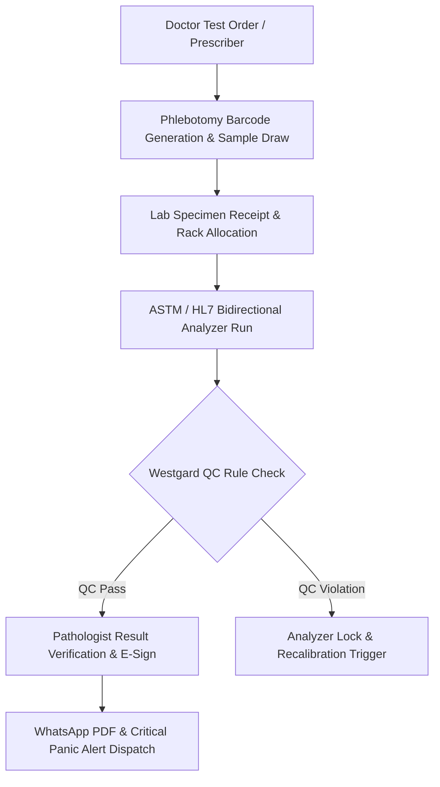

# Chapter 14: Laboratory Information System (LIS) & PathLab IQC Rules

## 14.1 LIS Phlebotomy Workflow, ASTM/HL7 Interfacing & Panic Alert Telemetry

The Laboratory Information System (LIS) coordinates sample collection, barcode tracking, bidirectional analyzer interfacing, result verification, critical panic alerts, and NABL quality compliance across Pathology, Biochemistry, Hematology, Microbiology, Histopathology, and Molecular Diagnostics.

### 14.1.1 Phlebotomy Barcode Generation, Sample Tracking & Rack Management
- **Phlebotomy Sample Barcoding:** Generates unique 1D/2D barcode labels at phlebotomy counters or bedside draw stations, capturing Sample ID, Patient UHID, test parameters, sample draw timestamp, and color-coded tube container types:
  - *Purple Top (K2/K3 EDTA):* Complete Blood Count (CBC), HbA1c, Peripheral Blood Smear.
  - *Light Blue Top (3.2% Sodium Citrate):* Coagulation profile (PT/INR, APTT, D-Dimer).
  - *Gold / Red Top (SST Gel Activator):* Clinical Biochemistry, Serology, Thyroid, Hormone panels.
  - *Gray Top (Sodium Fluoride / Potassium Oxalate):* Fasting & Post-Prandial Plasma Glucose.
- **Real-Time Sample Lifecycle Tracking:** Tracks sample status through 6 discrete states: `Collected` $\rightarrow$ `In-Transit` $\rightarrow$ `Received in Lab` $\rightarrow$ `Testing In-Progress` $\rightarrow$ `Doctor Verified` $\rightarrow$ `Published`.
- **Automated Rejection Workflow:** Logs sample rejection reasons (*Hemolyzed, Clotted, Insufficient Quantity / QNS, Wrong Container, Unlabeled*) with automated SMS/WhatsApp alerts for repeat sample collection.

### 14.1.2 ASTM / HL7 Bidirectional Analyzer Interfacing & Panic Alert Telemetry
- **Bidirectional Analyzer Interfacing:** Direct ASTM E1381/E1394, HL7 v2.x, and TCP/IP serial integration with clinical auto-analyzers (*Biochemistry: Roche Cobas, Abbott Architect, Siemens Atellica; Hematology: Sysmex XN, Beckman Coulter; Immunoassay: bioMérieux VIDAS*).
- **Worklist Querying & Automated Result Parsing:** Auto-streams test worklists to analyzers as samples pass barcode readers, parsing raw test result values, unit conversions, and reference ranges straight into patient EMR charts without manual data entry.
- **Critical Panic Alert Telemetry:** Automated real-time alert trigger flagging life-threatening panic values:
  - *Serum Potassium:* < 2.5 mEq/L or > 6.5 mEq/L.
  - *Hemoglobin:* < 5.0 g/dL or > 20.0 g/dL.
  - *Platelet Count:* < 20,000/μL or > 1,000,000/μL.
  - *Blood Glucose:* < 40 mg/dL or > 500 mg/dL.
  - *Troponin I / T:* Positive / Elevated Cardiac Biomarkers.
- **Instant Panic Alert Escalation:** Fires instant high-priority SMS, WhatsApp, and audio dashboard alerts to the attending doctor and chief nursing station, capturing doctor read-receipt confirmation within 15 minutes as mandated by NABL standards.

---

## 14.2 PathLab Internal Quality Control (IQC) & Westgard Rules Engine

### 14.2.1 Levey-Jennings (L-J) Charts & Westgard Rules Engine
- **Levey-Jennings Plotting:** Real-time plotting of daily control run data (Level 1 Normal, Level 2 Pathological, Level 3 High Pathological) displaying Mean ($\mu$) and Standard Deviation ($\pm 1SD, \pm 2SD, \pm 3SD$) boundaries.
- **Automated Westgard Multi-Rule Evaluation Engine:** Evaluates control data against 6 standard Westgard rules:
  - **$1_{2s}$ Warning Rule:** Single control observation exceeding $\pm 2SD$ (triggers warning alert).
  - **$1_{3s}$ Rejection Rule:** Single control observation exceeding $\pm 3SD$ (detects random error; rejects run).
  - **$2_{2s}$ Rejection Rule:** Two consecutive control observations exceeding $+2SD$ or $-2SD$ (detects systematic error; rejects run).
  - **$R_{4s}$ Rejection Rule:** Range between 2 control runs within a run exceeds $4SD$ (detects random error; rejects run).
  - **$4_{1s}$ Rejection Rule:** Four consecutive control observations exceeding $+1SD$ or $-1SD$ (detects systematic shift/trend).
  - **$10_x$ Rejection Rule:** Ten consecutive control observations fall on one side of the mean (detects systematic bias).
- **Auto-Lock on QC Violation:** Automatically blocks patient test result reporting on that specific analyzer channel whenever a Westgard rejection rule is triggered until recalibration and corrective action logs are submitted.

### 14.2.2 Reagent Lot Calibration, Open-Vial Timers & NABL Audit Vault
- **Lot Calibration Verification:** Prevents running patient tests on new reagent lots until lot-to-lot parallel testing ($R^2 \ge 0.98$) and calibration verification are completed.
- **Open-Vial Stability Timers:** Tracks open-vial expiration timers for reconstituted calibrators, controls, and working reagents, locking expired vials automatically.
- **NABL ISO 15189 Audit Readiness Vault:** Maintains 1-click digital compliance reporting for NABL / ISO 15189 audit inspections, including EQA/PT (External Quality Assurance / Proficiency Testing) Z-score tracking, equipment maintenance logs, technician competency records, and environmental temperature/humidity logs (20°C–25°C).

