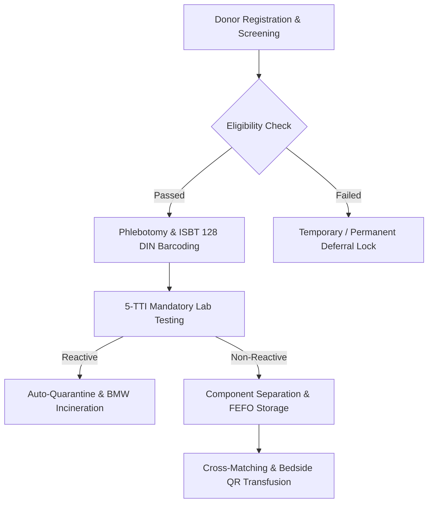

# Chapter 16: Comprehensive Blood Bank & Stem Cell Bio-Repository

## 16.1 Regulatory Architecture & ISBT 128 Barcoding

Complies with the **Drugs & Cosmetics Act 1940 / Rules 1945 (Schedule F Part XII-B)**, **NBTC**, and **NACO** guidelines.

### 16.1.1 ISBT 128 DIN Barcoding Standard
- **Donor Identification Number (DIN):** Generates a globally unique 13-character ISBT 128 barcode DIN for every donation. The DIN tracks the donor, collection bag, separated blood components (*PRBC, FFP, Platelet Concentrate, Cryoprecipitate*), lab test samples, and final transfusion recipient.

### 16.1.2 5-TTI Screening & Discard Lock
- **Mandatory 5-TTI Testing:** Enforces lab testing for **5 Transfusion-Transmissible Infections**:
  1. HIV 1 & 2 Antibodies.
  2. Hepatitis B Surface Antigen (HBsAg).
  3. Hepatitis C Antibodies (HCV).
  4. Syphilis (VDRL / RPR).
  5. Malaria Parasite (Microscopy / Antigen).
- **Auto-Quarantine & BMW Discard:** Any reactive test result instantly locks all separated components from that donor in quarantine, triggering auto-generation of Bio-Medical Waste (BMW) incineration vouchers and notifying the donor confidentially.

### 16.1.3 FEFO Cold-Chain Storage & Cross-Matching
- **Temperature Monitoring:** Real-time telemetry tracking storage equipment (+2°C to +6°C PRBC Refrigerators, -30°C FFP Deep Freezers, +20°C to +24°C Agitated Platelet Incubators).
- **Cross-Matching & Bedside QR Scanning:** Major/minor cross-matching (Coombs test). Dual-nurse bedside QR scanning verifies bag DIN against patient wristband prior to transfusion.

---

## 16.2 Statutory Blood Donor Eligibility & Deferral Matrix

| Parameter / Criteria Category | Statutory Standard / Rule | Compliance Logic & System Action |
| :--- | :--- | :--- |
| **Donor Age** | 18 to 65 Years | System blocks registration if Age $< 18$ or $> 65$. |
| **Body Weight** | Min 45 kg (350ml bag) / Min 55 kg (450ml bag) | Auto-selects bag volume based on recorded donor weight. |
| **Hemoglobin (Hb)** | Mandatory $≥ 12.5 g/dL$ | Blocks collection if $Hb < 12.5 g/dL$. |
| **Vitals (BP, Pulse, Temp)** | BP 100–140 / 60–90 mmHg, Pulse 60–100 bpm, Temp < 37.5°C | Auto-validates vitals before authorizing phlebotomy. |
| **Donation Interval** | Male (90 Days / 3 Mos), Female (120 Days / 4 Mos), Platelet (48 Hours) | Auto-calculates days since last donation; locks premature attempts. |
| **Temporary Deferral (24 Hrs)** | Alcohol Consumption | 24-hour temporary deferral lock. |
| **Temporary Deferral (14 Days)** | Fever, Acute Infection, Antibiotic Course Completion | 14-day temporary deferral lock. |
| **Temporary Deferral (6 Mos)** | Tattooing, Body Piercing, Major Surgery, Blood Transfusion Receipt | 6-month temporary deferral lock. |
| **Temporary Deferral (12 Mos)**| Rabies Hyperimmune Vaccine, Childbirth / Lactation, Needle-stick Injury | 12-month temporary deferral lock. |
| **Permanent Deferral (Lock)** | History of HIV, Hepatitis B/C, Syphilis, Malignancy, Cardiac Failure, IV Drug Use | Permanent blacklist flag across all tenant hospital branches. |

---

## 16.3 Voluntary Donor Registry & Mobile Camps

- **Voluntary Donor Master Registry:** Classifies donors as Voluntary Regular, Replacement, Emergency Standby, or Rare Group (*Bombay $O_h$, Rh-null, AB-ve*).
- **GPS Radius Search & WhatsApp Alerts:** Finds eligible donors within a 5km / 10km / 25km radius and sends 1-click WhatsApp emergency alerts with RSVP buttons.
- **Mobile Donation Camp Engine:** Coordinates outdoor blood drives with NGOs and universities, featuring mobile phlebotomy rosters and digital certificates.

---

## 16.4 Umbilical Cord Blood & Stem Cell Bio-Repository

### 16.4.1 Cord Blood Collection & Processing
- **Cord Blood Collection & Transport:** Maternal-fetal umbilical cord blood collection log capturing collection volume, gravity transport time, and temperature data logging.
- **Mesenchymal & Hematopoietic Stem Cell Processing:** Tracks MNC (Mononuclear Cell) count, CD34+ cell viability percentage, flow cytometry gating, and microbial sterility testing.

### 16.4.2 Cryopreservation & Liquid Nitrogen Vault Tracking
- **Cryopreservation & Liquid Nitrogen Vault Tracking:** Barcoded bio-bank rack, canister, and cane location indexing inside -196°C Liquid Nitrogen ($LN_2$) cryo-tanks.
- **Auto-Telemetry Temperature Alarms:** Continuous 24/7 temperature and liquid nitrogen level telemetry with SMS/WhatsApp emergency alerts for bio-bank temperature excursions.
- **Stem Cell Transplant & Thawing Ledger:** Stem cell release authorization, controlled-rate thawing log, infusion tracking, and engraftment monitoring.
