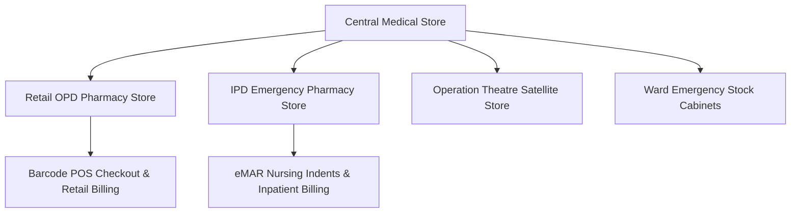
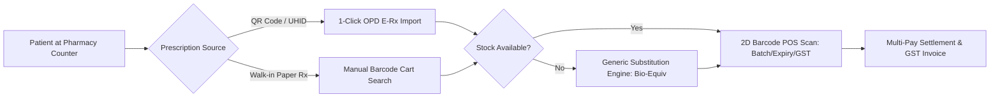

# Chapter 17: Pharmacy POS, FEFO Multi-Store & Supply Chain Management

## 17.1 Multi-Store Inventory Architecture & FEFO Engine

The Pharmacy & Supply Chain module manages drugs, medical consumables, surgical equipment, and diagnostic reagents across multi-store hospital networks.

### 17.1.1 Multi-Store Hierarchy & Storage Locations
- **Retail OPD Pharmacy (Outpatient Medical Store):** High-velocity retail sales counter serving OPD patients and walk-in customers with direct cash, card, UPI, or e-wallet settlement.
- **IPD Emergency Pharmacy (Inpatient Medical Store):** Fulfills digital medication indents requested by nursing stations, auto-posting charges to running IPD patient folios.
- **OT Satellite Store:** Specialized pharmacy store supplying pre-packaged surgical kits (*Laparoscopy Kit, Cardiac Surgery Pack, Orthopedic Implant Tray*) and emergency intra-operative medications.
- **Central Medical Store:** Bulk procurement, supplier GRNs, vendor returns, and inter-store stock distribution hub.

### 17.1.2 First-Expiry, First-Out (FEFO) Picking Algorithm
- **Automated FEFO Enforcement:** When dispensing drugs or issuing stock, the system automatically suggests batches with the earliest expiry dates. Dispensing a later-expiring batch while an earlier-expiring batch exists requires managerial override, preventing expired drug losses.

### 17.1.3 Master Drug Formulary & Regulatory Schedules
- **Formulary Controls:** Master drug database categorized by generic name, brand name, drug class, dosage form, strength, and Schedule flags:
  - **Schedule H & H1 Controls:** Mandatory recording of prescribing doctor registration number and patient details.
  - **Schedule X Narcotic Controls:** Double-lock inventory tracking with serial-numbered prescription vouchers and daily balance sign-offs.

---

## 17.2 Medical Store Billing, POS Checkout & Return Workflows

The Medical Store Billing module coordinates retail point-of-sale checkout, e-prescription processing, drug substitution, and return credit notes.

### 17.2.1 Barcode POS Checkout Counter
- **High-Velocity 2D DataMatrix Scanning:** Scans 2D DataMatrix barcodes on medicine strips/boxes, auto-fetching:
  - **Batch Number & Expiry Date:** Validates batch authenticity and locks expired items.
  - **Maximum Retail Price (MRP):** Auto-calculates retail sale price.
  - **HSN Code & GST Slabs:** Auto-applies statutory HSN codes and GST rates ($5\%, 12\%, 18\%$).

### 17.2.2 1-Click E-Prescription Import
- **Instant Cart Auto-Population:** Pharmacists scan the QR code on the patient's mobile phone or input UHID. The POS screen instantly imports the doctor's active e-prescription, populating prescribed drug names, dosages, and exact quantities.

### 17.2.3 Generic Drug Substitution Engine
- **Bio-Equivalent Generic Recommendations:** When a prescribed brand name is out of stock, the system displays bio-equivalent generic substitutes with identical Active Pharmaceutical Ingredients (APIs), dosage forms, and strengths, displaying price comparisons to the patient.

### 17.2.4 Schedule H, H1 & X Regulatory Dispensing Locks
- **Schedule H / H1 Compliance:** Auto-captures Prescribing Doctor Name, Medical Council Registration Number, Patient Address, and Aadhaar/Mobile on the official GST tax invoice.
- **Schedule X Narcotics Double-Lock:** Dispensing Schedule X narcotic drugs (*e.g., Fentanyl, Morphine, Pethidine*) requires dual-pharmacist biometric fingerprint sign-off, recording serial-numbered narcotic prescription vouchers and updating the daily statutory narcotic register.

### 17.2.5 Patient Medicine Return & Credit Note Engine
- **Returned Medicine Processing:** Handles returned unopened medicine strips brought by patients:
  - Verifies original bill invoice number and batch expiry validity.
  - Generates official **GST Credit Notes** or processes instant cash/e-wallet refunds.
  - Auto-restocks returned medicines back into inventory using FEFO logic.

---

## 17.3 Ward Indents, Automated Purchasing & GRN

### 17.3.1 Ward Stock Indenting & Nursing Requisitions
- **Ward Indent Flow:** Nurses generate digital stock requisitions from ward stores to the central pharmacy. Pharmacy staff pick, pack, and issue items, updating ward stock ledgers in real time.

### 17.3.2 Automated Purchase Order (PO) & Reorder Levels (ROL)
- **Automated ROL Calculation:** Auto-computes minimum stock levels and Reorder Levels (ROL) based on consumption velocity:

$$\text{Reorder Level (ROL)} = (\text{Average Daily Consumption} \times \text{Lead Time Days}) + \text{Safety Stock}$$

- **Auto-PO Generation:** Automatically generates draft Purchase Orders when stock reaches safety thresholds, sending RFQs to approved vendors.

### 17.3.3 Goods Receipt Note (GRN) & Batch Entry
- **GRN Entry:** Logs incoming shipments capturing purchase order reference, vendor invoice number, batch numbers, manufacturing dates, expiry dates, MRP, purchase rate, trade discounts, GST, and manufacturer Certificate of Analysis (CoA) upload.
