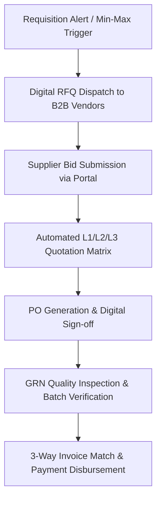

# Chapter 18: B2B Vendor Portal & Universal Master Inventory Catalog

## 18.1 B2B Supplier Portal & Automated Quotation Comparison

The B2B Vendor Portal streamlines hospital procurement, Request for Quotation (RFQ) dispatch, vendor bid evaluation, Purchase Order (PO) issuing, Goods Receipt Note (GRN) quality inspection, and 3-way invoice matching across supplier networks.

### 18.1.1 Supplier Self-Service Portal & Vendor Onboarding Vault
- **Digital Vendor Onboarding & Statutory Verification:** Approved suppliers log into a secure self-service B2B portal to manage company profiles, tax registrations (GSTIN, PAN), Drug Licenses (Form 20B/21B), ISO/GMP quality certifications, and banking details for electronic fund transfers (NEFT/RTGS).
- **Automated License Expiry Alerts:** Tracks vendor Drug License and GST validity dates, sending automated 60-day renewal alerts and suspending PO generation if a vendor's statutory license expires.
- **Digital RFQ & Purchase Order Dispatch:** Automatically broadcasts electronic RFQs to registered vendors based on minimum inventory threshold triggers. Vendors view active RFQs, download technical specifications, and submit competitive bids directly through the portal.

### 18.1.2 Automated L1 / L2 / L3 Quotation Comparison & PO Generation
- **Automated Price Comparison Engine:** Compiles incoming vendor quotations into structured comparison matrices, auto-ranking suppliers into Lowest Bidder 1 (L1), L2, and L3 tiers based on unit prices, bulk volume discounts, payment credit terms (e.g., *30/60/90 days net*), warranty coverage, and guaranteed delivery lead times.
- **Purchase Order (PO) Workflow & Approval Escalation:** Auto-generates formal digital POs from approved L1 quotations, enforcing multi-tier financial authorization sign-offs based on PO monetary thresholds (*e.g., Purchase Officer $< ₹50k$, Materials Manager $< ₹5 Lakhs$, Finance Director $> ₹5 Lakhs*).

---

## 18.2 Goods Receipt Note (GRN), 3-Way Invoice Matching & Vendor Performance Scorecards

### 18.2.1 GRN Inspection, Batch Sample Verification & Quarantine Workflow
- **Goods Receipt Note (GRN) Physical Inspection:** Upon physical delivery at the hospital central warehouse, storekeepers scan incoming shipments against the active PO.
- **Batch Verification & Expiry Audit:** Records manufacturer batch numbers, manufacturing dates, expiry dates, and MRP for every item. Rejects shipments with short shelf-life ($< 60\%$ remaining shelf-life or $< 6$ months to expiry).
- **Cold-Chain & QC Quarantine:** Temperature-sensitive biologicals and vaccines undergo cold-chain data-logger inspection (2°C–8°C). Reagents undergo Quality Control (QC) lot verification prior to releasing stock from quarantine to active inventory.

### 18.2.2 3-Way Invoice Matching & Vendor Performance Scorecard
- **Automated 3-Way Matching Engine:** Verifies that details across **Purchase Order (PO) == Goods Receipt Note (GRN) == Vendor Invoice** match exactly in quantity, unit price, tax rate, and payment terms before releasing payments for finance approval.
- **Vendor Rating & Performance Scorecard:** Evaluates suppliers on 4 key metrics:
  1. *On-Time Delivery Rate:* Percentage of orders delivered within specified lead time.
  2. *Quality Compliance Rate:* Percentage of items passing GRN physical and QC inspection.
  3. *Price Competitiveness:* Ratio of L1 winning bids versus market benchmarks.
  4. *Documentation Accuracy:* Error-free tax invoices and batch certificate compliance.
- Low-scoring vendors are flagged for procurement review or blacklisted from future RFQ broadcasts.

---

## 18.3 Universal 8-Tier Master Inventory Classification Catalog

Categorizes 100% of hospital, clinic, diagnostic imaging, and PathLab inventory into an 8-tier master classification matrix:

1. **Pharmaceuticals & Biologicals:** Oral Formulations (*Tablets, Capsules*), IV Fluids (*NS, RL, D5*), ICU Injectables, Chemotherapy Agents, Vaccines, Biological Serums, Narcotics & Controlled Substances.
2. **Imaging Contrast Media:** MRI Gadolinium agents, CT Non-Ionic Iodine Contrast (*Iopamidol, Iohexol*), Barium Suspensions, Fluoroscopy Radiopaque Dyes.
3. **PathLab Biochemistry & Hematology Reagents:** Auto-Analyzer Reagent Packs, Calibrators, Controls, Lyse Solutions, Wash Buffers, Enzymatic Substrates.
4. **Histopathology & Microbiology Media:** Formalin Fixatives, Paraffin Wax, Culture Media Plates (*Blood Agar, MacConkey*), Antibiotic Susceptibility Discs, Gram Stain Reagents.
5. **Molecular PCR Reagents:** Viral Transport Media (VTM), RNA Extraction Kits, PCR Master Mixes, Primers/Probes, Next-Generation Sequencing (NGS) Reagents.
6. **Phlebotomy Vacutainers & Clinical Consumables:** K2/K3 EDTA, Sodium Citrate, SST Gel, Fluoride/Oxalate Tubes, Syringes, IV Cannulas, Endotracheal Tubes, Foley Catheters, Central Line Kits.
7. **Surgical Implants (RFID Tracked):** Orthopedic Plates/Screws, Joint Prostheses, Cardiac Pacemakers, Coronary Stents, Artificial Heart Valves, Ophthalmic Intraocular Lenses (IOL), Surgical Mesh.
8. **Housekeeping, BMW & Administrative Supplies:** Bio-hazard Bags (Red, Yellow, Blue, White), Chemical Disinfectants, Hand Sanitizers, PPE Kits, Thermal Printing Paper Rolls, Sterile Linen Gowns.
