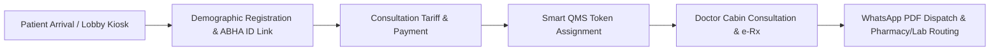

# Chapter 2: Outpatient (OPD) Registration, Consultation & Smart QMS

## 2.1 Outpatient OPD Registration & Workflow Lifecycle

The Outpatient Department (OPD) module manages the patient journey from initial lobby arrival through demographic registration, fee collection, queue tokening, doctor consultation, prescription dispatch, and diagnostic ordering.

### 2.1.1 Demographic Registration & National Health ID (ABHA)
- **Comprehensive Patient Demographic Profile:** Captures full legal name, date of birth, age, gender, blood group, primary phone number, alternate contact, email, residential address, emergency contact person, relationship, and preferred language.
- **Government ID Integration (ABHA / Aadhaar):** Direct integration with national digital health networks (ABHA / Ayushman Bharat Digital Mission). Patients scan their ABHA QR code at reception to auto-populate demographic fields, generating a verified digital health profile.
- **Photo & Document Capture:** Web-cam integration captures high-resolution patient headshots for visual identification on EMR banners and wristbands, and stores scanned copies of ID proofs, insurance cards, and past medical records.

### 2.1.2 OPD Tariff Engine & Follow-Up Rules
- **Dynamic Tariff Application:** Auto-calculates OPD consultation fees based on doctor seniority, clinical specialty, appointment category (*First Visit, Follow-Up, Emergency OPD, Teleconsultation*), and patient billing category (*Cash, TPA Insurance, Corporate Discount, PM-JAY*).
- **Automated Free Follow-Up Tracker:** Enforces statutory hospital follow-up rules (e.g., 14 days or 3 visits free follow-up). The billing engine automatically waives doctor consultation fees if a follow-up visit occurs within the valid window while charging standard registration fees if applicable.

---

## 2.2 30-Second E-Prescribing & Clinical Documentation

The E-Prescribing module enables doctors to record clinical encounters and generate legible, error-free digital prescriptions in under 30 seconds.

### 2.2.1 Clinical Notes, History Capture & ICD-10/11 Diagnosis Coding
- **Chief Complaints & History of Present Illness (HPI):** Fast-entry clinical interfaces with structured symptom pick-lists and free-text narrative boxes.
- **Mandatory ICD-10 / ICD-11 Diagnosis Coding:** Real-time auto-suggest search engine mapping provisional and final doctor diagnoses to international ICD-10 and ICD-11 codes (*e.g., I10 Essential Hypertension, E11.9 Type 2 Diabetes Mellitus, J06.9 Acute Upper Respiratory Infection*). Enforces mandatory ICD coding prior to OPD prescription sign-off for statutory compliance and TPA billing.
- **Vital Signs Recording:** Captures Blood Pressure (Systolic/Diastolic), Heart Rate (bpm), Pulse Oximetry (SpO2%), Respiratory Rate, Body Temperature (°F / °C), Body Weight (kg), Height (cm), and automatically computes Body Mass Index (BMI in $kg/m²$).

### 2.2.2 Fast Drug Selection & Template Prescribing
- **Master Drug Formulary Integration:** Doctors search a pre-loaded drug database containing over 50,000 generic and brand formulations, filterable by brand name, generic composition, dosage form (*Tablet, Capsule, Syrup, Injection, Ointment*), and strength (*500mg, 5ml*).
- **1-Click Clinical Specialties Templates:** Pre-configured prescribing bundles for common diagnoses (e.g., *Acute Upper Respiratory Infection, Essential Hypertension, Type-2 Diabetes Mellitus, Acute Gastroenteritis*), auto-filling drug names, dosages, frequencies (*1-0-1, 0-0-1*), timing (*Before Food, After Food*), and treatment duration.
- **WhatsApp PDF Prescriptions (`wa.me` Integration):** Upon final sign-off, the system compiles an official digital prescription featuring clinic letterhead, doctor digital signature, QR verification code, and dispatches an instant PDF download link straight to the patient's WhatsApp.

---

## 2.3 Smart Queue Management System (QMS) & Self-Service Kiosks

The Smart QMS module eliminates crowded waiting rooms and reduces patient friction through intelligent digital signage and mobile notifications.

### 2.3.1 Waiting Room Smart TV Signage Displays
- **Live Queue Displays:** High-definition Smart TV displays in waiting bays render real-time token queues synced instantly with doctor cabin software.
- **Multi-Doctor Cabin View:** Displays current token in consultation, next 3 upcoming tokens, estimated wait time, and doctor status (*In Cabin, On Emergency Round, On Lunch Break*).

### 2.3.2 Automated Mobile & WhatsApp Queue Notifications
- **Smart Queue Alerts:** Sends automated SMS and WhatsApp notifications as the patient's turn approaches (*"Dear Mr. Patel, your turn with Dr. Sharma in Cabin 4 is approaching in 2 tokens. Please proceed to Waiting Bay B"*).
- **Remote Queue Status Link:** Patients scan a QR code on their token receipt to track live waiting room status on their mobile phones while waiting in hospital cafeterias or gardens.

### 2.3.3 Lobby Self-Service Kiosks & Queue Busters
- **Touchscreen Self-Check-in:** Returning patients scan their UHID barcode or enter their mobile number at lobby kiosks to select a doctor, pay consultation fees via UPI/Card QR, and print a physical queue token without waiting at reception.

---

## 2.4 Clinical Decision Support System (CDSS) Safety Matrix

The CDSS engine runs real-time safety evaluations on every prescription prior to sign-off:

| CDSS Safety Check | Triggering Clinical Condition | System Action & Warning Level |
| :--- | :--- | :--- |
| **Drug-Allergy Cross-Check** | Prescribing Beta-Lactams (Amoxicillin) to a patient with logged Penicillin allergy | **High Severity (Red Popup):** Displays allergy severity history; requires doctor digital override code to proceed. |
| **Drug-Drug Interaction** | Prescribing Warfarin alongside NSAIDs (Aspirin / Ibuprofen) | **Medium Severity (Yellow Banner):** Warns of severe GI bleeding risk; recommends Paracetamol alternative. |
| **Pregnancy Contraindication** | Prescribing ACE Inhibitors (Enalapril) to a pregnant patient | **Critical Lock (Red Alert):** Blocks prescription generation due to fetal malformation risk. |
| **Pediatric Dosage Verification** | Prescribing adult antibiotic dosage to a child under 12 yrs | **Dosage Warning:** Auto-calculates recommended mg/kg body weight dosage and flags overage. |
| **Duplicate Therapeutic Class** | Prescribing 2 Proton Pump Inhibitors (Omeprazole + Pantoprazole) | **Warning Banner:** Flags redundant active ingredients within the same prescription. |

---

## 2.5 Kiosk Self-Registration API Architecture (`self_registration.py`)

### 2.5.1 Unauthenticated Self-Registration Endpoints
To enable touch-screen kiosk stations in hospital lobbies without exposing administrative credentials:
* **Dedicated Router** ([`backend/app/routers/self_registration.py`](file:///d:/Website/DIGIFORTLABS/backend/app/routers/self_registration.py)): Provides rate-limited, scoped endpoints for walk-in patient self-registration.
* **Aadhaar / ABHA QR Auto-Fill**: Parses VCard and ABHA QR JSON payloads to auto-extract full name, date of birth, gender, address, and mobile number.
* **Instant Token Generation**: Generates a temporary registration token and OPD consultation queue entry upon fee payment confirmation via integrated UPI QR display.

