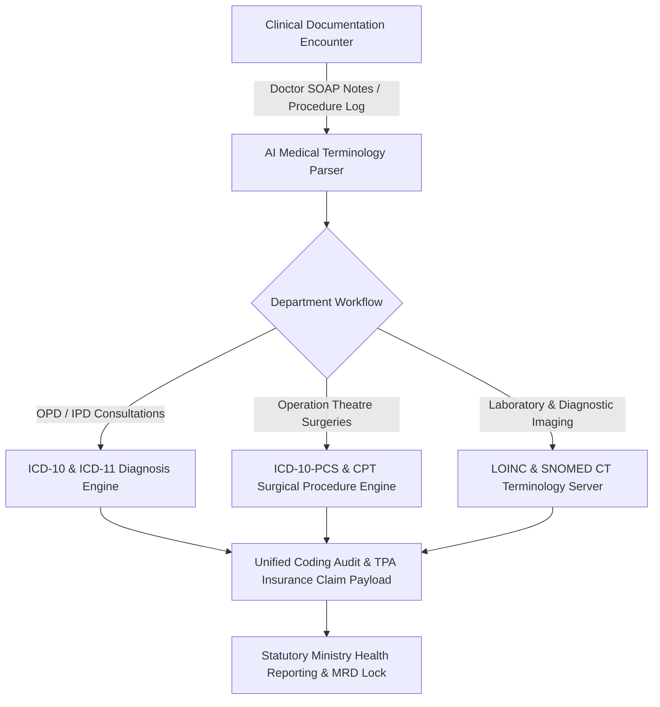

# Chapter 21: Universal Clinical Terminology & Coding Systems (ICD-10/11, CPT)

## 21.1 Comprehensive Universal Medical & Surgical Coding Standards

The Clinical Coding Engine manages automated terminology mapping, diagnostic classification, surgical procedure coding, and billing code validation across all clinical departments (OPD, IPD, Emergency, Surgery OT, LIS, RIS/PACS, and MRD).

### 21.1.1 International Classification of Diseases (ICD-10 & ICD-11)
- **Unified ICD Auto-Suggest Engine:** High-performance real-time search auto-completes ICD-10 and ICD-11 codes from doctor clinical notes in under 50 milliseconds.
- **Dual Coding System Support:** Supports concurrent mapping between legacy ICD-10 (*e.g., I10 Essential Hypertension, E11.9 Type 2 Diabetes Mellitus*) and WHO ICD-11 foundation entity URIs (*e.g., 5A11 Type 2 Diabetes Mellitus, BA00 Essential Hypertension*).
- **Primary & Secondary Diagnosis Structuring:** Mandates recording:
  - **Primary Diagnosis:** Main condition responsible for admission or consultation.
  - **Secondary Diagnoses & Co-Morbidities:** Pre-existing conditions impacting patient care.
  - **Complications & Hospital-Acquired Conditions (HAC):** Secondary events occurring during inpatient stay.

### 21.1.2 ICD-10-PCS & CPT Surgical Procedure Coding
- **Procedural Classification (ICD-10-PCS):** Enforces 7-character alphanumeric ICD-10-PCS structure for all inpatient surgical procedures (*e.g., 0FT44ZZ Laparoscopic Cholecystectomy, 0SR90JZ Total Knee Replacement*), mapping Section, Body System, Operation, Body Part, Approach, Device, and Qualifier.
- **Current Procedural Terminology (CPT-4):** Integrates standard 5-digit CPT codes for outpatient procedures, minor OT interventions, diagnostic imaging, and physician services to streamline private insurance and TPA reimbursement claims.

### 21.1.3 SNOMED CT & LOINC Clinical Terminology Server
- **SNOMED CT Semantic Engine:** Poly-hierarchy clinical terminology server mapping granular doctor clinical findings, anatomical sites, and etiology to SNOMED CT concepts for national EHR interoperability (ABDM compliance).
- **LOINC Diagnostic Interfacing:** Maps laboratory test parameters and radiology observation protocols to LOINC codes (*e.g., 2345-7 Glucose in Blood, 24606-2 CT Head without contrast*) for seamless electronic health record exchange.

---

## 21.2 Cross-Module Automated Coding Enforcers

| Hospital Department / Module | Primary Coding Vocabulary | Enforcer Logic & Trigger Action |
| :--- | :--- | :--- |
| **Outpatient E-Rx (OPD)** | ICD-10 / ICD-11 | Mandatory ICD diagnosis selection before prescription sign-off & PDF dispatch. |
| **Inpatient Wards (IPD)** | ICD-10 / ICD-11 & HAC | Live bed grid displays primary ICD code; billing lock on missing discharge ICD code. |
| **Operation Theatre (OT)** | ICD-10-PCS & CPT-4 | Enforces pre-op ICD diagnosis & procedural PCS code before OT slot confirmation. |
| **Pathology & Lab (LIS)** | LOINC & SNOMED CT | Auto-attaches LOINC codes to outgoing HL7 test result payloads. |
| **Radiology PACS (RIS)** | LOINC & RadLex | DICOM Modality Worklist maps imaging protocols to LOINC codes. |
| **MRD Archives & Billing** | Unified ICD/PCS Vault | MRO audit desk performs final code validation before statutory reporting & box sealing. |
