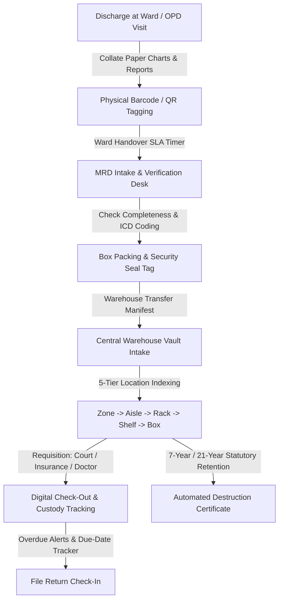
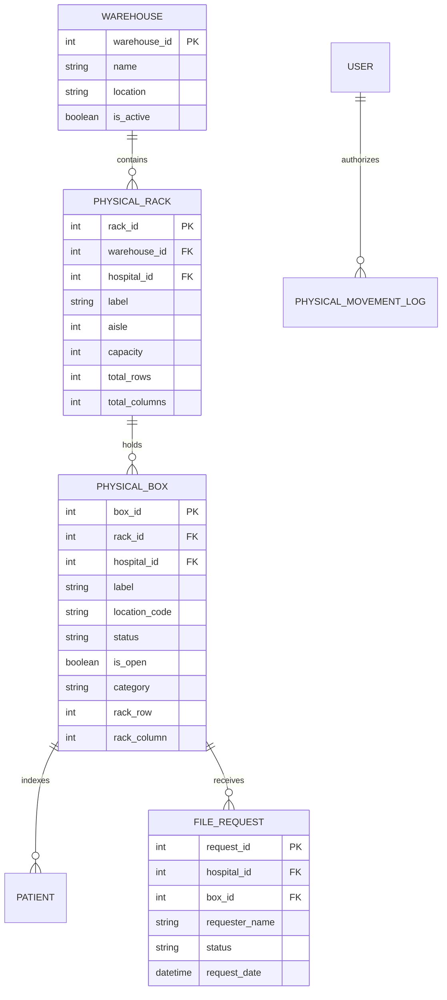

# Chapter 22: Medical Records Department (MRD) & Physical Warehouse Store

## 22.1 Medical Records Department (MRD) & Physical Warehouse Operations

The Medical Records Department (MRD) module governs clinical record archiving, ICD-10/11 disease coding, 5-tier warehouse storage, physical rack store room layout mapping, chain-of-custody tracking, and statutory retention destruction protocols following patient discharge handover.



### 22.1.1 Cloud S3 & Physical Warehouse Dual-Archiving Operations
- **AWS S3 Discharge-Date Cloud Hierarchy:** Cloud storage automatically categorizes patient scans, PDFs, and clinical records under hospital-isolated S3 keys based strictly on **Discharge Date (`YYYY/MM`)**:
  - `s3://digifort-labs-files/{Hospital_Legal_Name}/MRD/{YYYY}/{MM}/{MRD_ID}_{UUID}.enc`
  - Scans are compressed via Gzip and encrypted (`.enc`) prior to upload for maximum security and bandwidth efficiency.
- **Administrative Important Documents Vault:** Administrative hospital certifications, licenses, and SOPs are stored in a dedicated folder:
  - `s3://digifort-labs-files/{Hospital_Legal_Name}/Important_Documents/{Filename}.pdf`
- **Dynamic S3 File Relocation Engine:** Whenever a patient's `discharge_date` is edited in the system, `StorageService.relocate_patient_s3_files` automatically copies S3 objects to the matching `YYYY/MM` folder, purges old keys, and updates `s3_key` & `storage_path` in PostgreSQL in real time.
- **Automated Disease Coding:** Auto-suggests international ICD-10 / ICD-11 disease classification codes based on discharge summary diagnoses, supporting statutory reporting and insurance audit compliance.
- **Step-by-Step MRD Warehouse Store Operation:**
  1. **Discharge & Ward Handover:** Upon patient discharge, ward nurses collate all physical paper documents (consent forms, doctor progress notes, nursing charts, diagnostic prints). The folder is tagged with a unique **MRD Barcode Label**.
  2. **Intake & Verification Audit:** The physical folder is dispatched to the central MRD desk. An MRD clerk scans the barcode, verifies document completeness against the digital EMR, assigns ICD-10/11 codes, and signs off custody.
  3. **Batch Box Packing & Tamper-Evident Seals:** Files are packed into heavy-duty archive boxes (e.g., Box `BOX-2026-0842`). The box is sealed with a tamper-evident barcode seal.
  4. **5-Tier Location Indexing:** The box is transported to the physical archive warehouse and assigned a precise 5-tier location tag:
     - `Facility/Warehouse ID` $\rightarrow$ `Zone (A/B/C)` $\rightarrow$ `Aisle/Row (01-50)` $\rightarrow$ `Rack/Shelf (01-10)` $\rightarrow$ `Box Number (BOX-0842)`
  5. **Digital Requisition & Chain-of-Custody (Check-Out / Check-In):**
     - When a file is required for a Court Subpoena, Insurance Audit, or Readmission, a digital requisition request is raised.
     - Handheld barcode/RFID scanners track the exact file box withdrawal.
     - System enforces automated return due-date timers (e.g., 7 days max check-out) with instant overdue notifications to the MRD Head.
  6. **Environmental Telemetry & Pest Logs:** Maintains digital logs for warehouse temperature (18°C–22°C), relative humidity (40%–50%), fire safety systems, and quarterly pest eradication.
  7. **Statutory Retention & Destruction Protocol:** Tracks mandatory retention periods (Adult IPD: 7 years, Pediatric/Medico-Legal: 21 years). When retention expires, the system generates a formal **Destruction Certificate Payload**, requiring dual MRD Officer & Legal Head approval before physical shredding.

### 22.1.2 Physical Store Room Rack Layout & Visual Warehouse Mapping
To provide clear physical understanding for warehouse staff, the MRD system models the physical store room with a visual 3D/2D grid representation:

```mermaid
graph TD
    subgraph Central_MRD_Store["🏬 Central Physical MRD Warehouse Store Room"]
        direction TB
        
        subgraph Zone_A["🟢 Zone A: Active Records (0 to 3 Years)"]
            A1["Aisle 01: General Wards"] --> R1["Compactor Rack A1-R01"]
            R1 --> S1["Shelf S-04 (Level 4)"]
            S1 --> B1["Box: BOX-2026-0842"]
            B1 --> F1["📄 File: UHID 2026-9041 (John Doe)"]
        end

        subgraph Zone_B["🟡 Zone B: Long-Term Archives (3 to 7 Years)"]
            A2["Aisle 12: Surgical & ICU"] --> R2["Fixed Heavy Rack B2-R08"]
            R2 --> S2["Shelf S-02 (Level 2)"]
            S2 --> B2["Box: BOX-2023-0199"]
        end

        subgraph Zone_C["🔴 Zone C: MLC Medico-Legal & Pediatric (21 Years)"]
            A3["Aisle 25: MLC & Autopsy Vault"] --> R3["Fireproof Vault Rack C5-R01"]
            R3 --> S3["Shelf S-01 (Level 1)"]
            S3 --> B3["Box: BOX-MLC-2015-001"]
        end
    end
```



- **Physical Rack Indexing Code Breakdown (`WH1-ZA-A01-R03-S04-B0842`):**
  - `WH1`: Primary Hospital MRD Store Warehouse Facility.
  - `ZA`: Zone A (High-frequency access active records, 0-3 years).
  - `A01`: Aisle / Corridor Number 1.
  - `R03`: Compactor Heavy-Duty Mobile Rack Unit 3.
  - `S04`: Vertical Shelf Level 4 (Height level from ground).
  - `B0842`: Heavy-Duty Barcoded Archive Storage Box containing up to 25 physical patient folders.
- **Visual Warehouse Heatmap Dashboard:** Displays real-time capacity percentage per rack (*e.g., Rack A1-R03 at 92% full*), highlighting empty shelf slots for new box storage, temperature/humidity sensor statuses, and highlighted LED indicators on smart racks for fast file retrieval.

---

## 22.2 Technical RACK Schema, API & Models Specification (`storage.py`, `models.py`)

### 22.2.1 Core Relational Models & Schemas

The physical storage architecture is powered by 5 primary SQLAlchemy models ([`backend/app/models.py`](file:///d:/Website/DIGIFORTLABS/backend/app/models.py#L482-L550)):



1. **`PhysicalRack` Model Specification**:
   * `rack_id`: Primary Key integer.
   * `warehouse_id`: Foreign Key link to `Warehouse` master.
   * `hospital_id`: Multi-tenant tenant identifier (`Hospital`).
   * `label`: Unique barcode label (e.g., `RACK-A1-01`).
   * `aisle`: Corridor/Aisle integer index.
   * `capacity`: Total box capacity limit (default: 500).
   * `total_rows` & `total_columns`: Structural grid dimensions (default: 5 rows $\times$ 10 columns = 50 shelf slots).
2. **`PhysicalBox` Model Specification**:
   * `box_id`: Primary Key integer.
   * `rack_id`: Foreign Key link to `PhysicalRack`.
   * `rack_row` & `rack_column`: Exact grid cell placement on the parent rack.
   * `label`: Unique archive box barcode (e.g., `BX-1002`).
   * `location_code`: Computed deterministic location coordinate string (`WH1-ZA-A01-R03-S04-B0842`).
   * `status`: State string (`OPEN` vs `CLOSED`).
   * `is_open`: Active intake state boolean flag.
   * `category`: Archive document category (`GENERAL`, `MLC`, `BIRTH`, `DEATH`).
   * `capacity`: Max patient file folders per box (default: 100).
   * `sealed_date`: Datetime when status changed to `CLOSED`.

---

### 22.2.2 Warehouse Layout REST API Architecture ([`backend/app/routers/storage.py`](file:///d:/Website/DIGIFORTLABS/backend/app/routers/storage.py))

* **`GET /layout` — 2D/3D Grid Rendering Engine**:
  * Single optimized aggregation query calculating real-time occupancy (`func.count(PhysicalBox.box_id)`) grouped by `rack_id`.
  * Returns JSON structure organized by aisle number:
    ```json
    [
      {
        "aisle": 1,
        "racks": [
          {
            "id": "12",
            "name": "RACK-A1-01",
            "capacity": 500,
            "occupied": 412
          }
        ]
      }
    ]
    ```
* **`POST /racks` & `PUT /racks/{id}` — Rack Management**:
  * Provisions physical racks with custom row/column grid dimensions and assigns them to specific warehouse aisles.
* **`POST /boxes` & `PATCH /boxes/{box_id}/status` — Box Life-Cycle**:
  * Assigns boxes to rack grid positions (`rack_row`, `rack_column`).
  * Toggling a box to `is_open: true` automatically closes all other active open boxes for that hospital tenant to enforce single-active-box packing protocols.
* **`POST /files/bulk-assign` & `POST /files/bulk-unassign` — File Indexing**:
  * Bulk updates patient UHID records (`Patient.physical_box_id`) to assign patient physical charts into barcoded storage boxes.
* **`POST /file-requests` & `GET /movement-logs` — Requisition & Chain of Custody**:
  * Logs requisition check-outs/check-ins and maintains immutable movement records (`PhysicalMovementLog`).

---

### 22.2.3 Security & Role-Based Access Matrix

| Role | Warehouse Layout (`/layout`) | Location Code Visibility (`location_code`) | Rack/Box & File Administration |
| :--- | :--- | :--- | :--- |
| **`SUPER_ADMIN` / `WAREHOUSE_MANAGER`** | Full 2D/3D Grid Access | Full Unrestricted Access | Provision, Edit, Delete Racks & Boxes |
| **`HOSPITAL_ADMIN`** | Facility Warehouse Access | Full Access | Assign Boxes, Files & Oversee Audits |
| **`MRD_STAFF` (MRD Department)** | Facility Warehouse & Rack Map | Full Location Access for Authorized Requisitions | Box Packing, Barcode Tagging, Bulk File Assignment & Requisition Check-Out/Check-In |
| **`HOSPITAL_STAFF` / `RECEPTION`** | Access Blocked | Hidden / Masked | View File Request Status Only |

