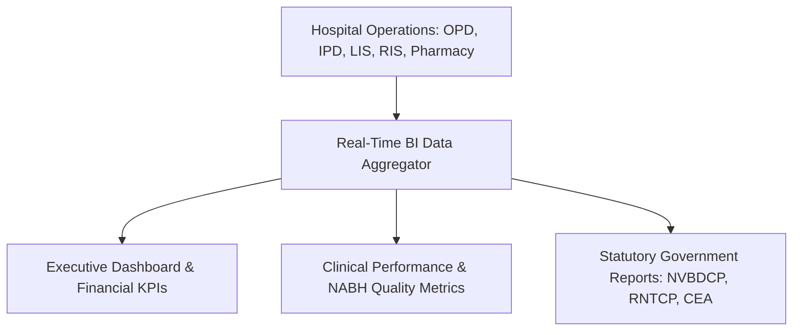
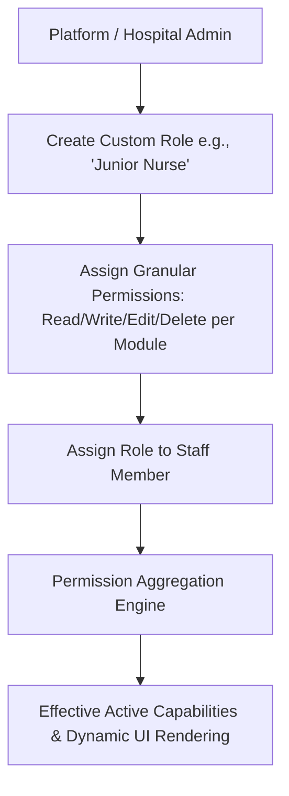
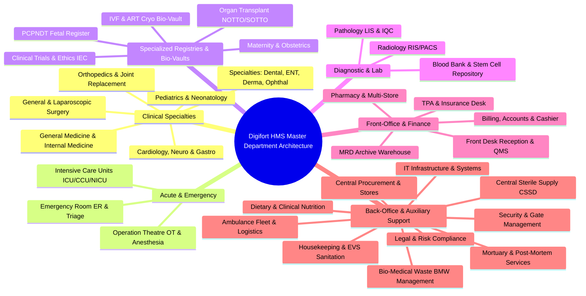
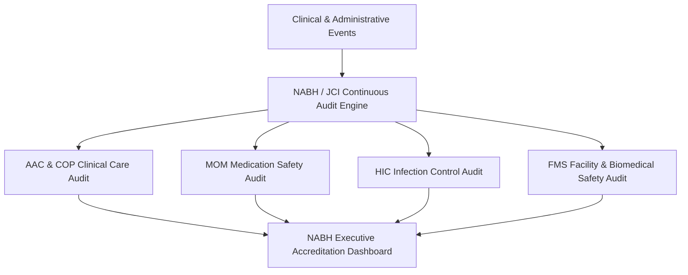
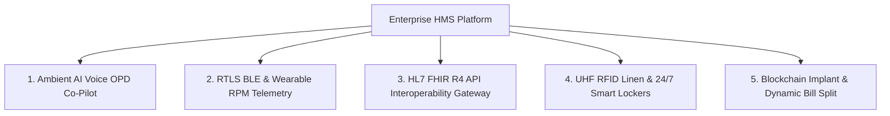

# Chapter 24: Business Intelligence Analytics & Master Configurations

## 24.1 Executive Analytics, BI Dashboards & Statutory Reports

The Business Intelligence & Management module compiles operational metrics, financial performance data, clinical quality benchmarks, and statutory government compliance reports.

### 24.1.1 Executive Operational & Financial Dashboards
- **Key Performance Indicators (KPIs):** Real-time executive dashboards rendering:
  - **Average Length of Stay (ALOS):** Tracks IPD bed stay efficiency across specialties.
  - **Bed Occupancy Rate (BOR %):** Live percentage occupancy of hospital bed capacity.
  - **Daily Revenue Collection:** Cash, Card, UPI, TPA Insurance, and Corporate collections.
  - **CMMS Downtime %:** Real-time biomedical equipment breakdown metrics.
  - **Blood Bank Stock Levels:** Real-time PRBC, FFP, and Platelet unit availability by blood group.
  - **TPA AI Denial Risk Scores:** Real-time audit score of pending insurance claims.
  - **QMS Wait Times:** Average patient waiting time from check-in to doctor consultation.

### 24.1.2 Statutory Government & Regulatory Reporting
- **Automated Public Health Reporting:** Auto-generates statutory public health notifications:
  - **RNTCP / Nikshay Portal:** Tuberculosis case notifications.
  - **NVBDCP Vector-Borne Diseases:** Malaria, Dengue, Chikungunya case tracking.
  - **CEA / NABH Quality Indicators:** Infection control metrics (VAP, CLABSI, CAUTI rates), surgical site infection rates, and needle-stick injury logs.

---

## 24.2 Dynamic Active Directory-Style Role-Based Access Control (RBAC)

DigifortLabs HMS enforces a highly granular, dynamic Role-Based Access Control (RBAC) architecture. Moving away from rigid, static roles, the platform allows administrators to create custom **"User Types" (Roles)** and assign specific **Read, Write, Edit, and Delete** permissions across all system modules—similar to Windows Server Folder Security.

### 24.2.1 Custom Roles & Granular Permissions Matrix
- **Custom User Types:** Hospital Admins can create hospital-specific roles tailored to their exact workflow. For example, an admin can create an `OPD Billing Clerk` role that only has `Read` access to patient records but `Write/Edit` access to the billing module.
- **Granular Permissions:** Every module (Patients, Billing, Pharmacy, LIS, PACS, HR, etc.) supports discrete permission toggles:
  - **Read:** Can view records and dashboards.
  - **Write (Create):** Can add new records or initiate workflows.
  - **Edit (Update):** Can modify existing records (e.g., updating a diagnosis).
  - **Delete:** Can soft-delete or hard-delete records (highly restricted).
- **System-Locked Roles:** Critical roles (e.g., `Super Admin`, `Platform Staff`, `Hospital Admin`) are system-locked and cannot be modified or deleted, ensuring foundational security.

### 24.2.2 Multi-Role Assignment & Permission Aggregation Engine
- **Multi-Role Assignment Capabilities:** A single employee or user account can hold $1$ to $N$ custom roles simultaneously. For example, a senior physician can be assigned both a `Consultant` role and a `Superintendent` role.
- **Dynamic Permission Union (Logical OR):** The system dynamically computes effective permissions by merging all assigned role capabilities (`Effective Permissions = Role_1 ∪ Role_2 ∪ ... ∪ Role_N`). If Role A grants `patients:read` and Role B grants `patients:delete`, the user inherits both capabilities.
- **Contextual UI Rendering:** The frontend applications automatically adapt to the user's aggregated permissions, hiding or disabling buttons (like "Delete Patient" or "Issue Refund") if the specific module:action permission is missing.

---

## 24.3 Master Hospital Department Hierarchy & Operational Matrix

The system structures all hospital activities across 5 core operational domains comprising clinical, diagnostic, specialized registry, administrative, and back-office auxiliary support departments.

### 24.3.1 Clinical Outpatient & Inpatient Departments
* **General Medicine & Internal Medicine (`DEPT_GEN_MED`)**: OPD consultations, chronic disease management, IPD ward care, CDSS safety checks.
* **General Surgery & Laparoscopy (`DEPT_SURGERY`)**: OT scheduling, pre-anesthesia clearance (PAC), operative notes, PACU monitoring.
* **Pediatrics & Neonatology (`DEPT_PEDIATRICS`)**: Vaccination tracking, growth charts, pediatric dosage verification, NICU care.
* **Orthopedics & Joint Replacement (`DEPT_ORTHO`)**: Fracture management, arthroplasty notes, high-value RFID implant tracking, ROM rehab.
* **Cardiology & CathLab (`DEPT_CARDIO`)**: ECG analysis, CathLab coronary angiography/angioplasty logs, cardiac ICU telemetry.
* **Neurology & Neurosurgery (`DEPT_NEURO`)**: Stroke management, GCS scoring, neuro-ICU telemetry, brain surgery flowsheets.
* **Gastroenterology (`DEPT_GASTRO`)**: Endoscopy/Colonoscopy reporting, hepatology notes, GI bleeding risk CDSS alerts.
* **Pulmonology & Respiratory Medicine (`DEPT_PULMO`)**: Spirometry, ABG telemetry, mechanical ventilator tracking, ICU respiratory notes.
* **Urology & Nephrology (`DEPT_UROLOGY`)**: Dialysis session logs, lithotripsy workflows, renal transplantation records.
* **Dermatology & Cosmetology (`DEPT_DERMA`)**: Outpatient skin procedures, laser therapy tracking, topical prescription templates.
* **Psychiatry & Behavioral Health (`DEPT_PSYCH`)**: Psychometric evaluation notes, therapy session logs, mental health confidentiality vault.
* **Dental Medicine & Maxillofacial (`DEPT_DENTAL`)**: 32-Tooth surface chart, 6-point periodontograms, 3D STL impression scans, dental lab orders.
* **Otorhinolaryngology (`DEPT_ENT`)**: Pure-Tone Audiometry (PTA) decibel graphs, Otoscopy/Rhinoscopy/Laryngoscopy exam templates.
* **Ophthalmology & Eye Care (`DEPT_OPHTHAL`)**: Visual acuity testing ($6/6$), refraction charts, intraocular pressure (IOP), cataract OT notes.

### 24.3.2 Acute, Emergency & Intensive Care Departments
* **Emergency Room (ER) & Trauma Unit (`DEPT_EMERGENCY`)**: ESI 5-level triage board, CPR resuscitation flowsheets, ambulance GPS fleet tracking.
* **Intensive Care Units (`DEPT_ICU`)**: HL7 real-time vital sign monitor feeds, ventilator settings, hourly nursing flowsheets.
* **Operation Theatre (OT) & Anesthesia (`DEPT_OT`)**: PAC approvals, surgical safety checklists, surgeon fee split, sterilization status verification.

### 24.3.3 Specialized Clinical Registries & Bio-Vault Departments
* **Obstetrics & Maternity (`DEPT_OBGYN`)**: ANC tracking, WHO Partograph, APGAR scoring, labor room delivery register (*NABH & MTP Act 2021*).
* **IVF, Fertility & ART Bio-Vault (`DEPT_IVF`)**: Surrogacy Act legal agreement vault, Gardner embryo grading, -196°C $LN_2$ cryo tank inventory.
* **Fetal Diagnostic & PCPNDT Registry (`DEPT_PCPNDT`)**: Form F mandatory auto-filing engine, monthly CMO portal exports, sex selection locks (*PCPNDT Act 1994*).
* **Organ Transplant Registry (`DEPT_TRANSPLANT`)**: 4-Doctor Brain Death certification panel, NOTTO/SOTTO matching, Cold Ischemia timers (*THOA 1994*).
* **Clinical Trials & Ethics Committee (`DEPT_ETHICS`)**: Protocol submission portal, 3-tier review board, e-ICF audio-visual consent vault, 24-hr SAE alerts (*CDSCO / ICMR*).

### 24.3.4 Diagnostic & Bio-Repository Departments
* **Pathology & Clinical Laboratory (`MODULE_LIS`)**: ASTM E1381 / HL7 analyzer machine links, Westgard QC rules, panic value alerts.
* **Diagnostic Imaging & RIS/PACS (`MODULE_RIS_PACS`)**: DICOM 3.0 MWL, Web PACS DICOM viewer, radiologist AI voice dictation.
* **Blood Transfusion Bank (`MODULE_BLOOD_BANK`)**: ISBT 128 DIN barcode generation, mandatory 5-TTI infection lock, cord blood repository.

### 24.3.5 Back-Office & Auxiliary Support Departments
* **IT Systems & Infrastructure Administration (`DEPT_IT`)**: Multi-tenant SaaS tenant provisioning, local server daemons (`local_scanner`, `local_wa_sender`), network security, dual-tier AWS S3 automated backup sync (`s3_backup.py`), and system audit logging.
* **Legal, Regulatory & Risk Management (`DEPT_LEGAL`)**: Enforcing DPDP Act 2023 digital consent vaults, court subpoena response, Medico-Legal Case (MLC) police MEMO tracking, statutory destruction certificates, and PCPNDT/MTP legal compliance.
* **Housekeeping & Environmental Services (`DEPT_EVS`)**: Bed sanitation status tracking (*Dirty $\rightarrow$ Under Cleaning $\rightarrow$ Sanitized & Ready*), ward Turn-Around-Time (TAT) monitoring, quarterly pest eradication logs, and HVAC/AHU positive pressure (≥ 15 Pa) telemetry.
* **Bio-Medical Waste (BMW) Management (`DEPT_BMW`)**: CPCB BMW 2016 compliance: 4-color waste segregation (Yellow, Red, White, Blue), Bluetooth scale weight logging at pickup, and Common Bio-Medical Waste Treatment Facility (CBWTF) manifest generation.
* **Central Sterile Supply Department (`DEPT_CSSD`)**: Surgical instrument set packing, barcode tracking, 121°C / 134°C autoclave cycle validation, UV-C sterilization logs, biological indicator pass locks, and OT pack distribution.
* **Dietary, Nutrition & Food Services (`DEPT_DIETA`)**: Clinical diet prescription execution (*Normal, Diabetic, Renal, Clear Liquid, TPN Parenteral*), kitchen bulk prep sign-off, ward tray delivery status tracking, and food safety temp logs.
* **Ambulance Fleet & Transport Logistics (`DEPT_TRANSPORT`)**: 24/7 emergency vehicle dispatch, real-time GPS fleet tracking, driver duty rosters, oxygen tank levels, resuscitation equipment checks, and vehicle maintenance/fuel logs.
* **Physical Security & Visitor Gate Control (`DEPT_SECURITY`)**: Visitor pass management, gate pass issuance for hospital assets, VIP security protocols, CCTV camera integration, mortuary police intimation handover, and infant security locks.
* **Vendor Relations & Central Procurement (`DEPT_PROCURE`)**: 8-Tier UNSPSC master product cataloging, automated vendor RFQs, supplier quotation comparison matrices, Purchase Orders (PO), and Goods Receipt Notes (GRN).
* **Mortuary & Post-Mortem Operations (`DEPT_MORTUARY`)**: Deceased patient intake, cold storage bay visual grid indexing (Free/Occupied/Sealed), MCCD Form 4/4A death certificate issuance, and forensic sample chain of custody.

---

## 24.4 NABH 5th Edition & JCI Compliance Verification Checklist

DigifortLabs HMS embeds an automated **NABH 5th Edition (National Accreditation Board for Hospitals & Healthcare Providers)** and **JCI (Joint Commission International)** Quality Audit Checklist Engine directly into executive BI analytics.

### 24.4.1 Comprehensive NABH 5th Edition Core Chapter Mapping

| NABH Chapter Code | Core Chapter Objective | System Verification Control & Hard Lock | Enforcing Chapter |
| :--- | :--- | :--- | :--- |
| **AAC (Access, Assessment & Care)** | Initial patient evaluation, ESI triage, lab/rad turnarounds. | Mandatory ESI 5-level triage engine; 30-sec initial assessment EMR forms; LIS panic alert logs. | **Ch 2, Ch 4, Ch 14, Ch 15** |
| **COP (Care of Patients)** | High-risk care protocols, OT PAC, ICU care, end-of-life care. | WHO Surgical Safety Checklist hard lock; ICU vital telemetry flowsheets; resuscitation logs. | **Ch 5, Ch 6, Ch 8, Ch 12** |
| **MOM (Management of Medications)** | High-alert meds, LASA look-alike sound-alike, FEFO batching. | Dynamic Drug-Drug interaction warnings; FEFO expiry blocks; barcode eMAR nursing verification. | **Ch 2, Ch 5, Ch 17** |
| **PRE (Patient Rights & Education)** | Informed consent, DPDP privacy, grievance handling. | Digital e-ICF consent vault with audio-visual recording; DPDP 2023 consent tracking; EMR masking. | **Ch 1, Ch 3, Ch 23** |
| **HIC (Hospital Infection Control)** | HAI surveillance, BMW rules, CSSD sterilizer validation. | VAP/CLABSI/CAUTI rate tracking; CPCB 4-color waste scales; Bowie-Dick & Biological Indicator locks. | **Ch 7, Ch 19** |
| **CQI (Continuous Quality Improvement)**| 27 NABH Mandatory Quality Indicators (QIs). | Automated calculation of ALOS, BOR %, Re-admission within 72 hrs, Needle-stick injury logs. | **Ch 24** |
| **ROM (Responsibilities of Management)**| Organizational hierarchy, statutory compliance. | 32-Role RBAC hierarchy; statutory license expiry reminders (AERB, Fire NOC, BMW, PNDT). | **Ch 1, Ch 24, Ch 25** |
| **FMS (Facility Management & Safety)** | CMMS breakdown SLAs, HVAC AHU HEPA pressure, fire safety. | Positive pressure (≥ 15 Pa) AHU telemetry; P1-P4 equipment repair SLA dispatch engine. | **Ch 7, Ch 19** |
| **HRM (Human Resource Management)** | Staff credentialing, 24/7 shift rosters, licensing alerts. | Medical/Nursing council registration expiry alerts (90/60/30 days); biometric shift rosters. | **Ch 25** |
| **IMS (Information Management System)**| EMR data security, physical chart archiving, ICD coding. | 5-Tier MRD Warehouse indexing (`WH1-ZA-A01-R03-S04-B0842`); ICD-10/11 unified coding server. | **Ch 21, Ch 22** |

---

### 24.4.2 27 Mandatory NABH Quality Indicators (QIs) Automated Calculator

1. **Inpatients Mortality Rate (IMR %):** Auto-compiled from Chapter 13 MCCD Form 4 death certificates.
2. **Gross / Net Surgical Mortality Rate:** Real-time cross-tabulation of OT surgical procedures vs. post-op deaths.
3. **Return to OT within 48 Hours (%):** Auto-flagged when a discharged OT patient re-enters surgical scheduling within 48 hours.
4. **Unplanned Re-Admission to ICU within 48 Hours (%):** Monitored via IPD Bed Transfers.
5. **Incidence of Hospital Acquired Infections (HAI Rates):**
   - **VAP Rate:** Ventilator Associated Pneumonia cases per 1,000 ventilator days.
   - **CLABSI Rate:** Central Line Associated Bloodstream Infection cases per 1,000 line days.
   - **CAUTI Rate:** Catheter Associated Urinary Tract Infection cases per 1,000 catheter days.
6. **Medication Error Rate (Per 1,000 Patient Days):** Tracks prescription errors, administration misses, and dosage overrides.
7. **Patient Fall Rate / Bedside Injury Rate:** Logged via IPD nursing incident reporting.
8. **Needle-Stick Injury (NSI) Rate:** Monitored via ICN infection control logs.
9. **Compliance to Hand Hygiene Practices (%):** Logged via periodic ICN observational audit forms.
10. **Door-to-Needle Time in ER Acute STEMI / Stroke:** Monitored via Chapter 4 ER resuscitation flowsheets.
11. **Average Length of Stay (ALOS):** IPD bed stay efficiency across clinical specialties.
12. **Bed Occupancy Rate (BOR %):** Live percentage occupancy of hospital bed capacity.
13. **OT Utilization Rate (%):** Operating theatre hours utilized vs. available scheduled hours.
14. **Cancellation Rate of Scheduled Surgeries (%):** Tracks canceled procedures and reason logs.
15. **Initial Assessment Completion Time (OPD & IPD):** Audit of initial assessment documentation SLAs.
16. **Discharge Summary Turnaround Time:** Time from clinical discharge order to patient handed final summary.
17. **Adverse Drug Reactions (ADR) Reporting Rate:** Pharmacovigilance reporting rate per 1,000 admissions.
18. **Blood & Blood Component Wastage Rate (%):** Expired or discarded units logged via Chapter 16 Blood Bank.
19. **Transfusion Reaction Rate:** Adverse blood transfusion reaction logs per 1,000 transfused units.
20. **Critical Diagnostic Panic Value Reporting Time:** Time from LIS/RIS panic value alert to physician acknowledgment.
21. **Pathology & Radiology Turnaround Time (TAT):** Sample collection / image scan to final report authorization.
22. **Biomedical Equipment Downtime Rate (%):** Real-time CMMS equipment availability metrics.
23. **Patient Satisfaction Score (OPD & IPD %):** Digital feedback surveys collected via WhatsApp/App.
24. **Staff Turnover Rate (%):** Logged via Chapter 25 HR management.
25. **Occupational Health Hazard Exposures:** Work-related injury and chemical exposure logs.
26. **Compliance with Bio-Medical Waste Segregation (%):** Monthly CPCB color bag audit scores.
27. **Near-Miss & Sentinel Event Reporting Rate:** Voluntary safety incident reporting metrics.

---

## 24.5 Next-Generation Strategic Roadmap & Advanced Architectural Pillars

DigifortLabs HMS defines 5 advanced architectural pillars for future system enhancements:

### 24.5.1 Ambient AI Clinical OPD Co-Pilot & Generative Voice Transcription
* **Multilingual Consultation Audio Transcription**: Background microphone audio capture transcribes doctor-patient conversations (Gujarati, Hindi, English) in real time.
* **Automated Clinical Summarizer**: AI engine auto-extracts chief complaints, examination findings, and prescriptions into 30-sec E-Rx format for single-click doctor verification.

### 24.5.2 Real-Time Location Systems (RTLS) & Wearable RPM Telemetry
* **Indoor BLE/NFC RTLS Asset Tracker**: Active BLE tags on mobile equipment (crash carts, IV pumps, wheelchairs) display real-time physical locations on 2D floor maps.
* **Continuous Wearable Remote Patient Monitoring (RPM)**: Streams home BP, pulse oximetry, and CGM glucose telemetry into the patient mobile PHR app with doctor alert thresholds.

### 24.5.3 Native HL7 FHIR R4 JSON Interoperability Gateway
* **Standardized Healthcare APIs**: Native FHIR R4 API server (`Patient`, `Encounter`, `Condition`, `Observation`, `MedicationRequest`, `DiagnosticReport`) for global EMR and insurance exchange.

### 24.5.4 UHF RFID Linen Automation & 24/7 Smart Pharmacy Lockers
* **Wash-Durable UHF RFID Linen Tracking**: Embedded RFID tags on ward bedsheets and OT scrubs track wash cycles, prevent inventory loss, and log laundry turnover.
* **Temperature-Monitored 24/7 Smart Pharmacy Lockers**: Refrigerated lobby pickup lockers allowing chronic patients to collect pre-filled prescriptions via WhatsApp QR code.

### 24.5.5 Blockchain Implant Serialization & Dynamic Cashless Package Split Engine
* **Immutable Implant Ledger**: Cryptographic hash tracking for cardiac stents and orthopedic implants from manufacturer batch code to patient surgical chart.
* **Dynamic Package Split Engine**: Real-time auto-adjuster separating GIPSA/TPA covered claims from non-covered out-of-pocket room upgrades during live stay.

