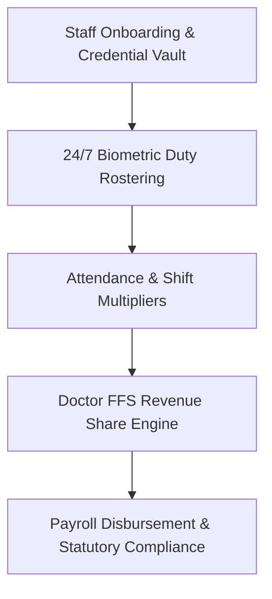

# Chapter 25: Human Resources, Staff Management, 24/7 Rostering & Doctor FFS Payroll

## 25.1 Enterprise Human Resources & Medical Credential Management

DigifortLabs HMS incorporates a specialized Human Resources Management System (HRMS) designed specifically for healthcare environments, clinical licensing compliance, and complex doctor Fee-For-Service (FFS) revenue share calculations.

---

## 25.2 Staff Onboarding & Medical Licensing Expiry Alerts

### 25.2.1 Digital HR Onboarding Vault
- **Staff Profiles & License Verification:** Digitally stores staff demographics, tax details (PAN/Form 16), bank accounts, Medical Council registration numbers (NMC/State Councils), Nursing Council IDs, and Pharmacy Council licenses.
- **Automated Licensing Expiry Telemetry:** Real-time background service monitors clinical credential expiration dates (BLS/ACLS, CME credits, Medical License renewal). Auto-sends 90-day, 60-day, and 30-day escalation alerts to both staff and HR administrators.

---

## 25.3 24/7 Shift Duty Rostering & Biometric Attendance Integration

### 25.3.1 Clinical Duty Rostering Engine
- **Multi-Shift Roster Planner:** Drag-and-drop 24/7 shift planning across Morning, Evening, Night, and On-Call rotations for doctors, nurses, radiographers, and support staff.
- **Biometric Device Interfacing:** Native TCP/IP integration with physical biometric fingerprint readers and facial recognition terminal hardware to log shift check-in/check-out and tardiness automatically.

---

## 25.4 Doctor Fee-For-Service (FFS) & Automated Revenue Share Engine

### 25.4.1 Comprehensive Doctor Payout Calculations
- **OPD Consultation Revenue Share:** Configurable percentage or fixed fee split per OPD consultation.
- **Surgical Procedure Split Engine:** Automated revenue sharing for lead surgeons, assistant surgeons, and anesthetists based on OT billing records.
- **IPD Daily Round Fee Aggregator:** Automatic compilation of daily inpatient ward visit charges.
- **Emergency On-Call Multipliers:** Flat-rate or hourly multipliers for emergency call-out visits.
- **External Referral Payout Reconciliation (`referrals.py`):** Automatically reconciles external doctor referral commission statements into monthly payout disbursements alongside FFS earnings.

---

## 25.5 Hospital Organizational Hierarchy & Reporting Organogram

### 25.5.1 Visual Hospital Organogram & Departmental Hierarchy
- **Multi-Level Department Mapping:** Interactive visual reporting structure mapping executive leadership (*Board of Directors, Medical Director, Chief Executive Officer*), clinical leadership (*Chief of Medical Services, Department Heads, Senior Consultants, Resident Doctors*), nursing management (*Nursing Superintendent, Ward In-Charges, Staff Nurses*), and administrative divisions (*Finance, Billing, HR, Materials/Stores, Biomedical Engineering, Housekeeping*).
- **Role-Based Governance & SLA Escalations:** Auto-routes incident reports, clinical approval requests, procurement purchase orders, and statutory compliance escalations according to the organogram reporting chain.
