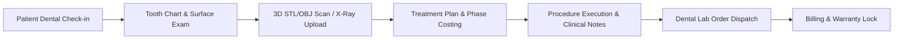

# Chapter 26: Dental EHR, 3D STL Imaging, Periodontics & ENT Audiometry Operations

## 26.1 Executive Summary & Scope

Specialty outpatient departments—specifically **Dental Medicine & Maxillofacial Surgery** and **Otorhinolaryngology (ENT)**—require specialized diagnostic flowsheets, 3D imagery visualization, and tailored clinical measurement tools beyond standard general OPD templates.

This chapter defines the functional requirements and architectural specifications for:
1. **Dental Electronic Health Record (EHR)**: Full 32-tooth permanent & 20-tooth primary dental charting, periodontograms, 3D STL/OBJ digital impression scan rendering, orthodontic progress tracking, and external dental lab order dispatching.
2. **ENT Specialty EHR**: Pure-Tone Audiometry (PTA) decibel threshold graph plotting, standardized endoscopic diagnostic examination flowsheets (Otoscopy, Rhinoscopy, Laryngoscopy), and specialized head and neck surgical protocols.

---

## 26.2 Dental EHR & Clinical Workflow Engine

### 26.2.1 Interactive Dental Tooth Charting Matrix
* **Tooth Identification System**: Support Universal Numbering System (1–32), FDI World Dental Federation notation (11–48 / 51–85), and Palmer Notation.
* **Surface-Level Diagnosis & Restoration Mapping**:
  * Visual marking of 5 surfaces per tooth: Mesial ($M$), Distal ($D$), Occlusal/Incisal ($O/I$), Facial/Buccal ($F/B$), and Lingual/Palatal ($L/P$).
  * Pre-defined pathology markers: Caries, Missing, Unerupted, Impacted, Fractured, Root Canal Treated (RCT), Crown (PFM/Zirconia), Implant, and Composite/Amalgam restorations.

### 26.2.2 Periodontal Examination & Measurement Grid
* **6-Point Pocket Depth Measurement**: Recording Probing Pocket Depth (PPD in mm) across Disto-Buccal, Mid-Buccal, Mesio-Buccal, Disto-Lingual, Mid-Lingual, and Mesio-Lingual aspects.
* **Periodontal Indicators**:
  * Bleeding on Probing (BOP) binary flag (% score auto-calculated).
  * Clinical Attachment Level (CAL) and Gingival Margin position.
  * Tooth Mobility Grade (Class I, II, III) and Furcation Involvement (Class I–IV).

### 26.2.3 3D Impression Scans & Orthodontic Records
* **Digital Impression File Storage**: Native web rendering and S3 bucket storage of `.stl`, `.obj`, and `.ply` 3D digital model files generated by intraoral optical scanners.
* **Orthodontic Cephalometric & Photo Vault**: Pre/Post treatment facial photography grid, cephalometric tracing storage, and aligner stage tracking.

### 26.2.4 External Dental Lab Order Management
* **Lab Work Order Generation**: Requisition generation for crowns, bridges, dentures, aligners, and surgical guides.
* **Shade Matching & Material Spec**: VITA Classical shade selection (A1–D4), material specification (Layered Zirconia, Monolithic, E.max, PFM, Cobalt-Chromium).
* **Chain of Custody & Trial Tracking**: Tracking impression dispatch, metal/wax try-in dates, bisque try-in, final cementation, and lab warranty card generation.

---

## 26.3 ENT (Ear, Nose & Throat) Specialty Operations

### 26.3.1 Pure-Tone Audiometry (PTA) & Hearing Diagnostics
* **Audiometric Threshold Graph Plotting**:
  * Dual-ear decibel ($dB HL$) plotting across standard frequencies ($125 Hz$ to $8000 Hz$).
  * Separate tracking for **Air Conduction (AC)** and **Bone Conduction (BC)** with masked/unmasked symbols ($O, X, \triangle, \square, <, >$).
* **Hearing Loss Degree Auto-Classification**:
  * Normal ($≤ 25 dB$), Mild ($26–40 dB$), Moderate ($41–55 dB$), Moderately Severe ($56–70 dB$), Severe ($71–90 dB$), and Profound ($> 90 dB$).
  * Speech Recognition Threshold (SRT) and Tympanometry Type A/B/C classification.

### 26.3.2 Endoscopic & Diagnostic Examination Flowsheets
* **Otoscopy Module**: Tympanic membrane status (Intact, Perforated, Retracted, Congested), pars tensa/flaccida findings, otorrhea details.
* **Rhinoscopy Module**: Nasal septum deviation (DNS side & severity), inferior turbinate hypertrophy, nasal polyp classification.
* **Laryngoscopy Module**: Vocal cord mobility, mucosal lesions, posterior commissure hypertrophy, Stroboscopy findings.

### 26.3.3 ENT Surgical Protocols
* Specialized pre-op & intra-op documentation for Tympanoplasty, Septoplasty, FESS (Functional Endoscopic Sinus Surgery), Tonsillectomy, Adenoidectomy, and Mastoidectomy.

---

## 26.4 Data Schema & API Endpoints

* **Backend Router**: [`backend/app/routers/dental.py`](file:///d:/Website/DIGIFORTLABS/backend/app/routers/dental.py) & [`backend/app/routers/ent.py`](file:///d:/Website/DIGIFORTLABS/backend/app/routers/ent.py)
* **Core Models**:
  * `DentalPatient`, `DentalTreatment`, `Dental3DScan`, `PeriodontalExam`, `PeriodontalMeasurement`, `OrthoRecord`, `DentalLab`, `DentalLabOrder`.
  * `ENTPatient`, `AudiometryTest`, `ENTExamination`, `ENTSurgery`.
* **Primary Endpoints**:
  * `GET /dental/patients/{id}/chart` — Retrieve full tooth chart state & historical procedures.
  * `POST /dental/3d-scans/upload` — Multipart upload for 3D intraoral STL files.
  * `POST /dental/lab-orders` — Create external dental lab order with shade selection.
  * `POST /ent/audiometry` — Log pure-tone audiometry test matrix and calculate hearing loss degree.
  * `POST /ent/examination` — Save structured Otoscopy/Rhinoscopy/Laryngoscopy exam data.
