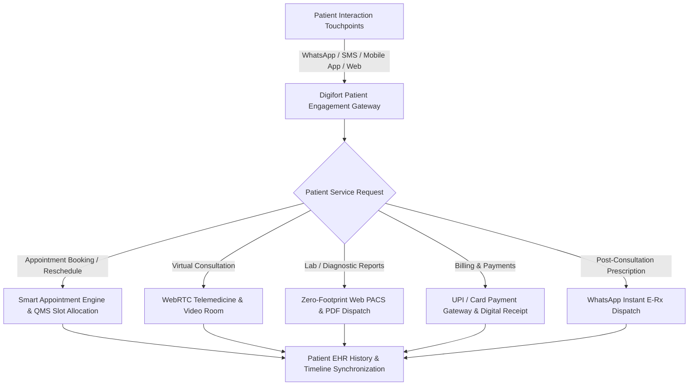

# Chapter 3: Patient Digital Engagement, Telemedicine & WhatsApp AI Portal

## 3.1 Multi-Channel Patient Digital Engagement Ecosystem

The Patient Digital Engagement suite provides seamless, paperless patient interaction across WhatsApp Business AI Automation, WebRTC Telemedicine, Mobile App Portals, and Self-Service Kiosks.

### 3.1.1 WhatsApp AI Chatbot & Interactive Messaging (`wa.me`)
- **24/7 Automated WhatsApp Assistant:** Interactive WhatsApp Business API chatbot enabling patients to interact directly via text or voice notes.
- **Interactive WhatsApp Capabilities:**
  - **1-Click Appointment Booking:** Patients select specialty, doctor, date, and time slot via interactive WhatsApp button menus.
  - **Live QMS Queue Tracking:** Real-time updates notifying patients of their live token queue status (*e.g., "Your token is #14. Doctor is currently examining #12. Estimated wait: 10 mins"*).
  - **Instant Diagnostic Report Downloads:** Dispatches secure PDF download links for Pathology Lab reports and Radiology PACS views as soon as results are authorized.
  - **Automated Visit & Medication Reminders:** Automated WhatsApp notifications for upcoming doctor appointments, follow-up dates, and daily prescription dosage reminders.

### 3.1.2 WebRTC High-Definition Telemedicine Suite
- **Browser-Based Video Rooms:** High-definition, encrypted WebRTC video consultation rooms running on PC, Mac, Android, and iOS without requiring third-party software downloads.
- **Integrated Doctor EMR Workspace:** Enables doctors to view the patient's full medical history, past vitals, lab reports, and Web PACS DICOM scans side-by-side on screen during the live video call.
- **Digital E-Prescription Dispatch:** Upon closing the virtual call, a digitally signed E-Prescription featuring clinic letterhead, doctor digital signature, and QR verification code is automatically dispatched to the patient's WhatsApp and email.

---

## 3.2 Patient Self-Service Mobile App & Portal Features

### 3.2.1 Native iOS & Android Patient Mobile App
- **Patient Personal Health Record (PHR Vault):** Centralized health vault storing past OPD prescriptions, IPD discharge summaries, vaccination certificates, surgical records, and allergies.
- **Family Profile Management:** Allows a primary account holder to manage healthcare records, appointments, and lab test downloads for dependents (*children, elderly parents*).
- **UPI & Payment Gateway Integration:** One-click OPD registration fee payment, IPD advance deposit top-up, and diagnostic bill payment via UPI (Google Pay, PhonePe, Paytm), Credit/Debit Cards, and Net Banking.

### 3.2.2 ABHA (Ayushman Bharat Digital Mission) Health ID Sync
- **ABHA Registration & QR Scan:** Allows patients to create or link their national 14-digit ABHA Number and ABHA Address (`name@abdm`).
- **Consent-Based Health Data Exchange:** Enables secure, consent-driven sharing of health records between external ABDM-compliant hospitals, clinics, and diagnostic centers.
