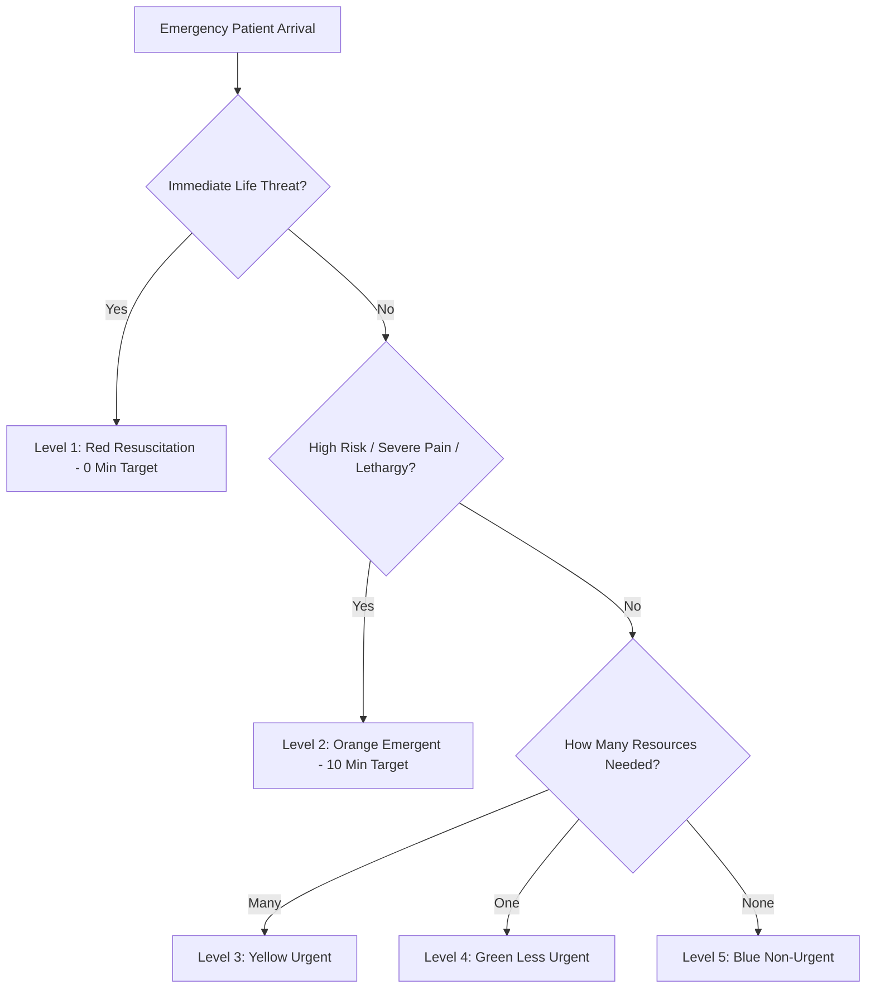
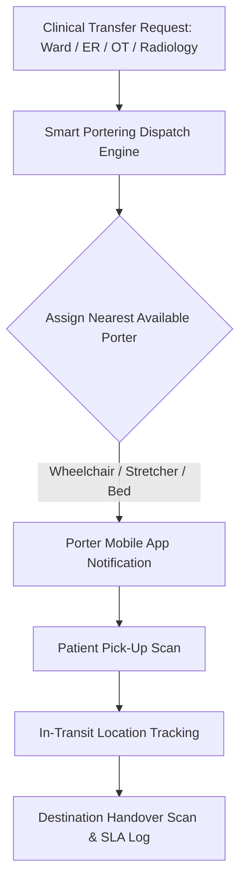

# Chapter 4: Emergency Room (ER), ESI Triage & Ambulance Fleet Operations

## 4.1 Emergency Severity Index (ESI) 5-Level Triage Engine

The Emergency Department (ED) enforces standardized rapid triage protocols adhering to the **Emergency Severity Index (ESI)** 5-level algorithm to prioritize life-threatening conditions upon patient arrival.

### 4.1.1 ESI Triage Level Classification & Clinical Cutoffs

| Triage Level | Clinical Criteria & Presentation | Target Physician Assessment | System Action & Triage Workflow |
| :--- | :--- | :--- | :--- |
| **Level 1 (Red - Resuscitation)** | Cardiac arrest, respiratory arrest, severe anaphylaxis, massive trauma, un-evaluable vitals, GCS $< 8$. | **0 Minutes (Immediate)** | Triggers Resuscitation Room alarm, alerts ED Lead Physician & ICU team; auto-reserves Trauma Bay 1. |
| **Level 2 (Orange - Emergent)** | Chest pain suspicious for MI, severe respiratory distress, acute stroke symptoms (< 4.5 hrs), severe pain (8-10/10). | **Max 10 Minutes** | Assigns priority bed in Acute Care Bay; auto-orders STAT 12-lead ECG & Troponin-I. |
| **Level 3 (Yellow - Urgent)** | Abdominal pain, high fever with stable vitals, simple fractures requiring multiple resources (Lab, X-Ray, IV fluids). | **Max 30 Minutes** | Routes to Urgent Care queue; orders baseline blood work & diagnostic imaging. |
| **Level 4 (Green - Less Urgent)** | Ankle sprain, minor laceration requiring simple suturing, urinary tract infection symptoms. | **Max 60 Minutes** | Routes to Minor Procedure / Fast-Track bay. |
| **Level 5 (Blue - Non-Urgent)** | Prescription refills, chronic rash without systemic symptoms, suture removal. | **Max 120 Minutes** | Routes to OPD / Fast-Track consultation counter. |

---

## 4.2 Trauma Bay Resuscitation Flowsheet

The Resuscitation module captures high-velocity clinical procedures performed during critical trauma care:

### 4.2.1 Real-Time Resuscitation Logs
- **Massive Transfusion Protocol (MTP Activation):** 1-click MTP trigger instantly dispatches emergency un-crossmatched O-Negative or type-specific packed red blood cells (PRBC), fresh frozen plasma (FFP), and platelets from the Blood Bank to the Trauma Bay.
- **Airway & Emergency Procedure Logging:** Records endotracheal intubation details (Macintosh blade size, endotracheal tube size, insertion depth, Cormack-Lehane grade visualization), central venous catheter (CVC) insertion site sign-off, and arterial line placement.
- **Defibrillation & Resuscitation Timers:** Built-in CPR timer logging 2-minute cycle intervals, Epinephrine administration timestamps, shock energy levels (200 J biphasic), and Return of Spontaneous Circulation (ROSC) times.

### 4.2.2 Emergency OT / ICU Direct Elevation Lock
- **Direct Elevation:** 1-click elevation from Emergency Trauma Bay straight into the Emergency Operation Theatre (EOT) or Intensive Care Unit (ICU) bed roster, bypassing standard OPD admission steps and auto-populating emergency pre-op surgical checklists.

---

## 4.3 Emergency Trauma & GPS Ambulance Fleet Management

The Ambulance Module coordinates emergency response, vehicle tracking, and in-transit clinical data streaming.

### 4.3.1 GPS Ambulance Fleet Tracking & Dispatch
- **Live Vehicle Telemetry:** Interactive GIS map displaying active ambulance fleet locations, movement speed, fuel levels, and driver duty rosters.
- **Automated Dispatch Engine:** Calculates nearest available ambulance based on real-time GPS coordinates, dispatching turn-by-turn navigation coordinates straight to the ambulance driver's mobile console.

### 4.3.2 Paramedic In-Transit Telemetry Streaming
- **Pre-Hospital EMR Integration:** Paramedics enter vital signs ($SpO_2$, HR, BP, 12-lead ECG strips) into mobile paramedic tablets while in transit. This clinical stream broadcasts in real time to the ED dashboard, allowing trauma surgeons to prepare intervention bays prior to ambulance arrival.

### 4.3.3 Emergency Billing & Distance Tariffs
- **Distance-Based Tariffs:** Automatically computes ambulance charges based on base dispatch rates plus per-kilometer charges. Consumed resuscitation drugs, oxygen cylinder usage, and paramedic fees are credited straight to the patient's Emergency billing folio.

---

## 4.4 Internal Patient Transport, Portering & Escort Dispatch System

DigifortLabs HMS coordinates internal patient transfers (ER $\rightarrow$ CT Scan $\rightarrow$ OT $\rightarrow$ ICU) using an automated Porter & Escort Task Dispatch Engine.

### 4.4.1 Smart Portering Task Allocation Engine
- **Automated Porter Dispatch:** When a doctor or nurse places a transport order (*e.g., ER to Radiology for Emergency Brain CT Scan*), the system calculates porter availability and dispatches tasks to porters' mobile app handhelds based on location proximity.
- **Equipment & Medical Escort Tags:** Requests automatically specify required transport assets:
  - **Wheelchair:** For conscious, stable patients.
  - **Stretcher / Trolley:** For non-ambulatory patients requiring flat positioning.
  - **Bed Transfer:** Motorized bed transfer with portable $O_2$ cylinder and multipara monitor.
  - **Clinical Escort Requirement:** Mandatory Nursing/Doctor escort tag for ESI Level 1/2 critical care patients.

### 4.4.2 Handover Scans & SLA Turnaround Time (TAT) Tracking
- **QR / Barcode Verification:** Porters scan the patient's UHID wristband upon pick-up at the originating ward and re-scan at the destination department (*e.g., Radiology CT Console*) to confirm positive patient identity and log exact transit start/end times.
- **SLA & Bottleneck Analytics:** Real-time dashboards track porter Turnaround Times (SLA threshold: $<10$ mins for Emergency, $<20$ mins for routine IPD transfers). Alerts highlight delayed patient transfers, preventing surgical or diagnostic bottlenecks.

