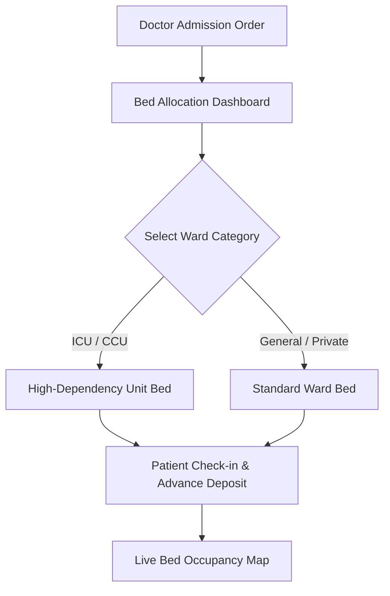

# Chapter 5: Inpatient (IPD), Ward Management, eMAR & ICU Telemetry

## 5.1 Inpatient Bed Allocation & Visual Ward Layout

The Inpatient Department (IPD) manages admitted patients with strict logical data isolation enforced by `hospital_id`.

### 5.1.1 Interactive Real-Time Visual Grid & ICD-10/11 Admission Coding
The visual bed grid displays live floor layouts across all hospital wings and wards (ICU, CCU, NICU, PICU, General Male/Female Ward, Semi-Private, Private Deluxe, Suite):
- 🟢 **Available (Green):** Bed clean, sanitized, and ready for patient admission.
- 🔴 **Occupied (Red):** Patient admitted; displays patient photo, UHID, admitting doctor, admission date/time, primary diagnosis, and **Mandatory ICD-10 / ICD-11 Disease Codes** (*Primary Admission Diagnosis, Secondary Co-Morbidities, & Complications*).
- 🟡 **Cleaning / Housekeeping (Yellow):** Patient discharged; bed undergoing ultraviolet/disinfectant sanitization.
- 🔵 **Maintenance / Out-of-Service (Blue):** Bed or bedside multipara monitor undergoing engineering repair.

### 5.1.2 Inter-Ward Transfers, Multi-Component Tariff & Pro-Rated Billing Engine
- **Multi-Component Ward Tariff Structure:** Each hospital ward enforces a configurable 4-part daily charge matrix:
  1. *Room & Bed Rent:* Daily bed charge based on category (ICU, Private Deluxe, Semi-Private, General).
  2. *Daily Doctor Consulting Fee:* Configurable per-day resident physician / consultant charge rate (`doctor_charge`).
  3. *Daily Nursing Care Fee:* Fixed daily nursing monitoring and care tariff (`nursing_charge`).
  4. *Bio-Medical Waste (BMW) Fee:* Daily CPCB compliant clinical waste disposal fee (`bio_medical_wastage_charge`).
- **Inter-Ward Transfers & Pro-Rated Billing Engine:** When a patient's clinical condition changes (e.g., stepping down from ICU to a Private Ward), nurses trigger a digital bed transfer. The system logs exact bed transfer timestamps and prorates room, doctor, nursing, and BMW charges across transfer wards down to the hour, eliminating billing disputes during final discharge.

---

## 5.2 Nursing Station Operations, Doctor Visits, eMAR & Vitals Telemetry

The Nursing Station module acts as the clinical command hub for admitted patient care, physician ward rounds, medication administration, and vital signs monitoring.

### 5.2.1 Doctor Ward Round Visits & Visiting Consultant Payout Engine
- **Dual Doctor IPD Billing Models:** Supports both consulting doctor billing workflows:
  - *Per-Day Model:* Automatic daily consulting charge calculation based on doctor profile rates.
  - *Per-Visit Model:* `IPDDoctorVisit` table logging manual bedside rounds with custom visit fees, doctor round notes, and instant integration into the patient's running bill.
- **Timed Ward Round Notes:** Doctors log timed SOAP progress notes (*Subjective, Objective, Assessment, Plan*) with digital signatures directly into the inpatient chart.

### 5.2.2 Medication Administration Record (eMAR) & Nurse Execution Log
- **Digital Pharmacy Indenting & Scheduled Dosing:** Inpatient prescriptions stream to nursing eMAR with precise dosage, administration route, frequency hours (e.g., Q8H, Q12H), and automatically calculated `next_due` timestamps.
- **Nurse Administration Logging:** Nurses log administered doses (`medication_log`), automatically advancing `next_due` alerts and triggering optional medication administration nursing fees on the running bill.
- **Double-Check Safety Sign-Off:** High-alert medications (Insulin, Heparin, Chemotherapy agents, Narcotics) require digital dual-nurse barcode sign-off before administration.

### 5.2.3 Continuous Vital Signs, Fluid Intake/Output & Early Warning Alerts
- **Nurse Vitals Flowsheet:** Daily logging of core vital parameters: Temperature (°F/°C), Systolic/Diastolic Blood Pressure (mmHg), Pulse Rate (bpm), $SpO_2$ (%), Respiratory Rate, and Blood Glucose (mg/dL).
- **Intake/Output Fluid Balance Logging:** Tracks 24-hour fluid intake (oral, IV fluids) versus fluid output (urine, surgical drains, nasogastric output) with net balance calculation.
- **Abnormal Vitals & Overdue Medication Alerts:** Automated alert engine flagging critical vital deviations (e.g., SpO2 < 95%, $\text{BP} > 140/90$, Fever > 99.5°F) or overdue medication doses directly to the nursing station dashboard.

### 5.2.4 IoT Bedside ICU Monitor Interfacing & HL7 Auto-Plotting
- **HL7 Vitals Auto-Plotting:** Bedside multipara monitors stream HL7 vitals (Heart Rate, $SpO_2$, Blood Pressure, Respiratory Rate, Temperature) directly into nursing vital flowsheets every 15 minutes, eliminating manual transcription errors and generating automated early warning scores (NEWS2).

### 5.2.5 Digital Nursing Shift Handover
- **Structured Shift Handover Notes:** Departing nurses log shift handovers capturing vital trends, fluid balance (total 24-hr intake vs. output in ml), IV line insertion dates, pending diagnostic reports, and physician special instructions.

---

## 5.3 Ward Support Operations & TPA Discharge Lock

### 5.3.1 Dietary & Kitchen Management
- **Clinical Diet Prescriptions:** Attending physicians and clinical dietitians prescribe specialized diets (*Diabetic 1500 kcal, High Protein, Renal Failure Low Sodium, Clear Liquid, Soft Bland*).
- **Kitchen Dispatch Dashboards:** Auto-compiles daily kitchen meal preparation reports grouped by ward, room number, and diet category. Nurses verify tray delivery by scanning QR codes on meal trays.

### 5.3.2 Linen & Laundry Management CMMS
- **Ward Linen Inventory Tracking:** Monitors daily issuance of clean bedsheets, pillow covers, patient gowns, and doctor scrubs across wards. Tracks wash and autoclave sanitization cycles, linen loss logs, and rag depreciation.

### 5.3.3 Automated TPA / Insurance Discharge Lock
- **Financial Discharge Lock:** Upon clinical sign-off, the system automatically locks physical bed release until the TPA insurance desk uploads the final corporate/insurer approval letter, preventing premature patient departure before billing settlement.

### 5.3.4 Internal Patient Transport, Portering & Escort Workflow
- **Dispatch & Portering Management:** Automated dispatching engine for internal hospital porters, stretcher bearers, and wheelchair escorts.
- **Inter-Departmental Transit Tracking:** Tracks real-time patient transit between Wards $\rightarrow$ Radiology (CT/MRI) $\rightarrow$ OT $\rightarrow$ Dialysis. Monitors Porter Turnaround Time (TAT) to eliminate procedural delay bottlenecks.

### 5.3.5 Complete IPD Patient Record Archiving & MRD Vault Handover
- **Consolidated IPD Case File Compilation:** Upon patient discharge, the system automatically compiles the complete inpatient record into a unified electronic chart bundle containing:
  - Admission Demographics, Emergency Triage Notes, & Consent Forms.
  - Doctor Daily Progress Notes (SOAP Format) & Multi-Specialty Consultation Notes.
  - Complete Nursing Vital Flowsheets, Fluid Intake/Output Charts, & eMAR Medication Logs.
  - Diagnostic Test Reports (Pathology LIS & PACS Imaging Studies with DICOM Links).
  - Surgery OT Notes, PAC Checklists, Implant Serials, & Anesthesia Records.
  - Discharge Summary, E-Prescriptions, & Follow-up Instructions.
- **Physical Chart Assembly & Barcode Tagging:** Physical paper charts, diagnostic envelopes, and consent forms collected during the stay are assembled into a standardized IPD folder and tagged with an **MRD Barcode Label**.
- **MRD Vault Handover Workflow:** Tracks physical chart transit from the Ward Nursing Station to the Central Medical Records Department (MRD) with digital sign-off, SLA handover timers, missing document alerts, and physical rack/box storage indexing.

