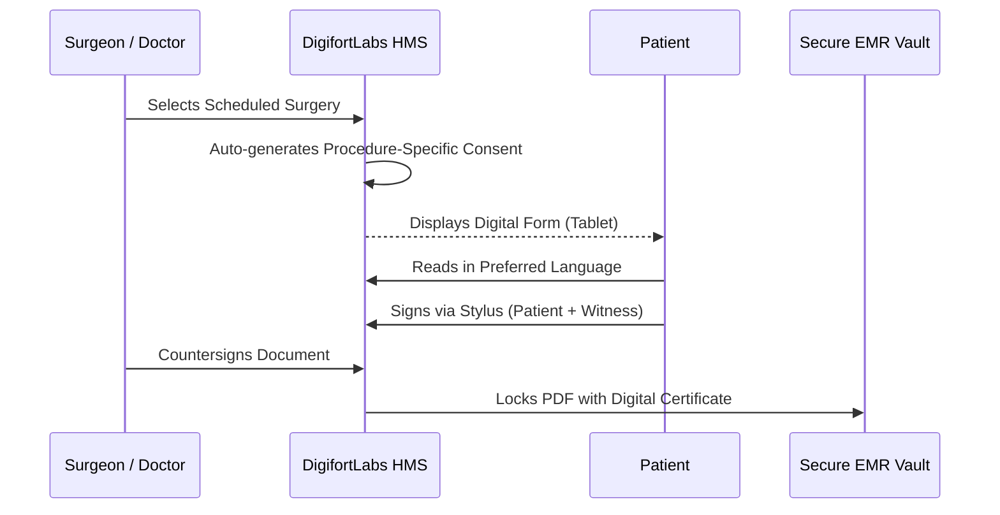

# Chapter 6: SURGERY AND OPERATION THEATRE

## 6.1 Overview

The OT module manages complex clinical workflows that require specialized equipment, multidisciplinary teams, and unique documentation formats. A core component of this is the digital capturing and management of Surgical Consent Forms.

## 6.2 Operation Theatre (OT) Management

Managing surgical workflows from pre-op preparation to post-op recovery.

### 6.2.1 OT Workflow Features

- **OT Scheduling & Consent:** Algorithmic booking of theatres, anesthetists, and surgeons. Digital capture of patient consent forms.
- **Surgical Notes & PAC:** Detailed Pre-Anesthesia Checkup (PAC) notes and structured surgical procedure logs.
- **OT Consumables Inventory:** Real-time deduction of surgical kits, implants, and medicines directly to the patient's billing folio.

```mermaid
graph TD
    A[Surgery Recommended] --> B[PAC Clearance]
    B --> C[OT Booking & Team Assignment]
    C --> D[Pre-Op Preparation (Ward)]
    D --> E[Surgery & Anesthesia Log]
    E --> F[OT Pharmacy/Consumables Billed]
    F --> G[Post-Op Recovery (ICU/Ward)]
```

### 6.2.2 Surgery List

To ensure accurate billing and insurance (TPA) claim processing, DigifortLabs HMS maintains a comprehensive Master Surgical Tariff list mapped directly to specific clinical departments.

| Department | Covered Surgeries / Procedures (Tariff List) |
| :--- | :--- |
| **General Surgery** | Appendicectomy (Open & Laparoscopic), Cholecystectomy, Hernia Repair (Inguinal, Umbilical, Incisional), Thyroidectomy, Mastectomy, Haemorrhoidectomy (Open & Stapled), Fissurectomy, Fistula-in-Ano, Exploratory Laparotomy, Colostomy, Hydrocele, Gastrectomy, Adhesiolysis. |
| **Gynaecology & Obstetrics** | Normal Delivery, Caesarian Section (LSCS), Hysterectomy (Abdominal, Vaginal, LAVH, TLH), Myomectomy, Ovarian Cystectomy, Tuboplasty, Dilatation & Curettage (D&C), Ectopic Pregnancy Operation, Colposcopy, Fimbrioplasty. |
| **Urology** | TURP (Prostate Resection), TURBT (Bladder Tumour), Nephrectomy (Radical/Partial), Nephrolithotomy (PCNL), Cystolithotomy, Ureterolithotomy, Pyeloplasty, Urethroplasty, Cystoscopy. |
| **Plastic & Reconstructive Surgery** | Abdominoplasty, Breast Augmentation/Reduction, Cleft Lip & Palate Repair, Rhinoplasty, Liposuction, Skin Grafting (Homograft/FTSG), Burn Management/Dressings, Flap Transplants (Local/Free Flap), Maxillofacial Fracture Reductions. |
| **Paediatric Surgery** | Omphalocele Repair, Hirschsprung's Pull Through, Hydrocephalus V-P Shunt, Syndactyly/Polydactyly Correction, Orchiopexy (Undescended Testis), Congenital Diaphragmatic Hernia, Thyroglossal Cyst Excision. |
| **Gastroenterology (Endoscopic)** | Upper GI Endoscopy, Endoscopic Sclerotherapy (EST), Endoscopic Variceal Ligation (EVL), PEG Tube Placement, Stricture Dilatation, Foreign Body Removal. |

### 6.2.3 Standardized OT Forms & Digital Consent Architecture

The DigifortLabs HMS digitizes a comprehensive suite of pre-operative, intra-operative, and post-operative forms to ensure strict clinical compliance and patient safety. The built-in library includes:

- **Pre-Operative Forms:** Pre Operation Evaluation, Preoperative Assessment Form, Surgical Safety Checklist
- **Anaesthesia & Sedation Forms:** Pre Sedation Assessment, Consent for Anaesthesia, Consent for Procedural Sedation, Procedure Without Sedation Record
- **Post-Operative & Discharge:** Operation Note, Modified Aldrete Scorecard, Post Sedation Discharge Criteria
- **General Consent:** Informed Consent for Medical Treatment

Informed consent is a critical legal and ethical requirement. The HMS digitizes this process, allowing hospitals to generate, capture, and securely store dynamic consent forms tailored to specific surgical procedures.

#### Digital Consent Capabilities

- **Biometric & Stylus Signatures:** Native support for capturing electronic signatures via tablets (e.g., iPads in the pre-op ward).
- **Multilingual Support:** Auto-translation of consent terms into the patient's primary language.
- **Audit Trails:** Immutable timestamps recording exactly when the patient, witness, and doctor signed the document.

#### Consent Templates by Surgery Type

| Surgery / Procedure Type | Specific Consent Clauses Included |
| :--- | :--- |
| **General Surgery (e.g., Appendectomy)** | Risks of general anesthesia, potential for open surgery conversion, infection risks. |
| **Orthopedic Surgery (e.g., Joint Replacement)** | Implant specifics (material, brand), deep vein thrombosis (DVT) risks, rehabilitation requirements. |
| **Cardiothoracic Surgery** | High-risk mortality clauses, bypass machine risks, ICU ventilation expectations. |
| **Obstetrics / Maternity (C-Section)** | Fetal distress risks, maternal hemorrhage, neonatal ICU admission clauses. |
| **Ophthalmology (e.g., Cataract, LASIK)** | Visual impairment risks, intraocular lens (IOL) choices, post-op vision expectations. |
| **Blood Transfusion** | Risks of bloodborne pathogens, allergic reactions, alternatives to transfusion. |

#### Consent Workflow



### 6.2.4 OT Cleaning, Turnaround & Infection Control Protocols

To maintain stringent infection control standards between consecutive surgeries, the HMS mandates and logs adherence to the **OT Turnaround Time (TAT) and Cleaning Protocol**. The system blocks the induction of the next patient until the housekeeping and nursing staff digitally sign off on the cleaning checklist.

**Between-Case Cleaning Protocol:**
- **Surface Disinfection:** Immediate mopping of the operating table, mayo stands, overhead surgical lights, and monitor touchscreens with a hospital-grade disinfectant (e.g., 1% Sodium Hypochlorite or Bacillocid).
- **Floor Cleaning:** The floor area within the sterile perimeter is wet-mopped to remove organic spills (blood/fluids).
- **Waste Segregation:** Secure removal of all bio-medical waste (BMW) bins (Yellow/Red bags) and sharp containers, logged into the BMW tracking module.
- **Air Quality & Instrument Swap:** Allowing adequate air exchanges (ventilation turnaround) before opening fresh sterile surgical sets and draping for the next patient.


### 6.2.5 Post-Operative Care & Ward Transfer

Following the successful completion of the surgery, the HMS facilitates a seamless handover from the Operation Theatre to the designated recovery area. This ensures continuity of care, precise medication administration, and accurate tracking of the patient's post-operative stay.

#### Patient Handover & Recovery Workflow
- **OT to Recovery Room (PACU) or ICU:** Immediate post-extubation, the patient is electronically transferred to the Post-Anesthesia Care Unit (PACU). If critical care is required, the patient will be shifted directly to the **ICU / MICU / SICU**. Vitals are continuously logged via integrated monitors until it is safe for ward transfer or step-down.
- **Ward / ICU Transfer Protocol:** The receiving nursing station (Ward or Intensive Care Unit) receives an automated alert indicating the impending arrival of the post-op patient. The system enforces a digital handover checklist to ensure the receiving nurse gets all necessary post-op orders, drain details, and catheter statuses.

#### Inpatient Stay & Medication Administration
Once settled in the inpatient ward, the HMS manages the remainder of the hospital stay:
- **Electronic Medication Administration Record (eMAR):** The system generates a strict schedule for post-op antibiotics, analgesics, and DVT prophylaxis as prescribed by the surgeon. Nurses scan the medication barcode and the patient's wristband before administration to ensure the "Five Rights" of medication administration.
- **Surgical Wound Care & Vitals:** Scheduled nursing tasks are automatically queued for wound dressing changes, drain output measurements, and pain scoring (e.g., VAS scale).
- **Dietary Orders:** The dietician module is updated with post-op dietary restrictions (e.g., NBM to clear liquids to soft diet), ensuring the IPD kitchen delivers the appropriate meals.
