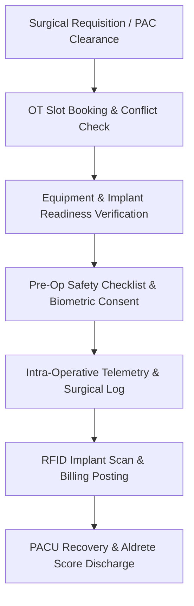

# Chapter 6: Surgery, Operation Theatre (OT) & High-Value RFID Asset Tracking

## 6.1 Operating Theatre Scheduling, Conflict Prevention & Equipment Dependencies

The Operation Theatre (OT) suite coordinates complex multi-specialty surgical workflows, anesthesia evaluations, pre-op safety checks, intra-operative clinical logs, surgical implant tracking, and post-anesthesia recovery care.

### 6.1.1 OT Scheduling & ICD-10-PCS / ICD-11 Surgical Procedure Coding
- **Multi-Theatre Room Rostering:** Schedules physical operating suites across specialized theatres (*Cardiothoracic OT, Orthopedic Laminar Flow OT, Neuro-Surgical OT, Minimally Invasive Laparoscopic OT, Ophthalmic Eye OT, Day-Care OT*).
- **Automated Surgeon & Anesthetist Conflict Prevention:** Real-time conflict engine preventing double-booking of lead surgeons, assistant surgeons, or anesthesiologists across simultaneous theatre slots.
- **Equipment Dependency Mapping:** Links required surgical hardware (*C-Arm Fluoroscopy, Laparoscopic Towers, Surgical Robots, Phacoemulsification Machines, Intra-Operative Ultrasound, Cell Savers*) to theatre bookings, ensuring equipment is sanitized, calibrated, and deployed prior to patient arrival.
- **Mandatory Surgical ICD-10-PCS / ICD-11 Procedure Coding:** Maps pre-operative diagnosis and intended surgical procedure to international ICD-10-PCS / ICD-11 procedure codes (*e.g., 0FT44ZZ Laparoscopic Cholecystectomy, 0SR90JZ Total Knee Replacement, 021209Z Coronary Artery Bypass*), enforcing mandatory coding prior to OT slot booking and TPA insurance pre-authorization approval.

### 6.1.2 Pre-Anesthesia Checkup (PAC) & Biometric Consent
- **Digital PAC Evaluation Engine:** Captures comprehensive anesthesia risk assessments:
  - *ASA Physical Status Classification:* ASA I (Normal) to ASA V (Moribund) and ASA E (Emergency).
  - *Airway Assessment:* Mallampati Score Class I–IV, Thyromental distance, jaw protrusion capability, and cervical mobility.
  - *Cardiovascular & Pulmonary Risk:* Cardiac ejection fraction, NYHA functional class, METs exercise tolerance, and chest X-Ray / ECG findings.
  - *Anesthetic History:* Previous anesthesia exposure, malignant hyperthermia history, difficult intubation alerts, and drug allergies.
- **Tablet Biometric Patient Consent Vault:** Captures digital signatures, patient photo confirmation, and biometric thumb impressions on tablet devices for surgical procedures, blood transfusions, limb amputation consents, and high-risk anesthesia waivers in accordance with legal and medico-legal standards.

---

## 6.2 Pre-Operative Preparation & WHO Surgical Safety Checklist

### 6.2.1 Surgical Ward Pre-Op Preparation Protocol
- **NPO (Nil Per Os) Countdown Tracker:** Monitors mandatory pre-op fasting hours for solids and clear liquids, sending automated nursing alerts to prevent aspiration risk.
- **Surgical Site Identification & Marking:** Digital confirmation of surgical site marking by the operating surgeon, verifying lateral side (*Left vs. Right limb/eye/kidney*) to prevent wrong-site surgery errors.
- **Jewellery, Prosthetics & Blood Cross-Match Verification:** Nursing checklist confirming removal of metallic jewellery, dentures, and hairpins, alongside verification of reserved packed red blood cells (PRBC) and fresh frozen plasma (FFP) from the Blood Bank.

### 6.2.2 WHO 3-Phase Surgical Safety Checklist
- **Phase 1: Sign-In (Before Induction of Anesthesia):**
  - Confirms patient identity, surgical site mark, procedure, and signed consent.
  - Verifies pulse oximeter functioning and known drug allergies.
  - Evaluates difficult airway / aspiration risk and anticipated blood loss ($> 500\text{ ml}$).
- **Phase 2: Time-Out (Before Surgical Incision):**
  - Formal pause where all team members (Surgeon, Anesthetist, Scrub Nurse, Circulator) introduce themselves by name and role.
  - Verbal confirmation of patient name, surgical procedure, exact anatomical site, and patient positioning (*Supine, Prone, Lithotomy, Lateral Decubitus*).
  - Verifies prophylactic antibiotic administration within the past 60 minutes.
  - Reviews anticipated critical steps, operative duration, and sterilizer indicator clearance for surgical instruments.
- **Phase 3: Sign-Out (Before Patient Leaves Operating Room):**
  - Nurse verbally confirms final surgical procedure name.
  - Verifies complete count of surgical sponges, needles, blades, and instruments.
  - Verifies correct labeling of pathology specimens with patient name, UHID, and tissue type.
  - Reviews equipment malfunction issues and post-op recovery management plan.

---

## 6.3 Intra-Operative Clinical Logging & RFID Implant Serialization

### 6.3.1 Real-Time Intra-Operative Anesthesia & Surgical Timeline
- **Automated Anesthesia Logbook:** Timed documentation of induction, intubation tube size, mechanical ventilation settings, volatile anesthetic agent concentrations (Sevoflurane/Desflurane), IV fluid volume, blood loss, and urine output.
- **Intra-Operative Narcotics Control:** Secure digital logbook tracking administration of controlled substances (*Fentanyl, Morphine, Pethidine, Midazolam, Propofol*), detailing administered dosage, wasted quantities, counter-signatures, and syringe disposal.

### 6.3.2 RFID High-Value Implant Serialization & Billing Integration
- **Implant Barcode & UHF RFID Scanning:** Scans high-value surgical implants (*Orthopedic Joint Prostheses, Cardiac Pacemakers, Coronary Stents, Artificial Heart Valves, Ophthalmic IOLs, Surgical Mesh*) inside the theatre room.
- **Automated Serialization Capture:** Auto-populates manufacturer batch serial numbers, GTIN barcodes, UDI (Unique Device Identifier), and expiry dates directly into the patient's electronic medical chart.
- **Real-Time Revenue Posting:** Instantly posts implant charges to the patient's running bill while auto-updating national implant registries and inventory re-order levels.

---

## 6.4 PACU Post-Op Recovery & Aldrete Score Discharge Criteria

### 6.4.1 PACU Recovery Telemetry & Vital Flowsheets
- **Continuous PACU Monitoring:** Tracks post-anesthesia vital signs every 5 minutes (*BP, Heart Rate, $SpO_2$, ECG rhythm, Core Body Temperature*).
- **Pain & Nausea Score Management:** Monitors Visual Analog Scale (VAS 0–10) pain scores, administering prescribed IV analgesics and antiemetics.

### 6.4.2 Modified Aldrete Recovery Scoring Engine
- Evaluates 5 recovery parameters ($0–2$ points each):
  1. *Activity:* Able to move 4 extremities voluntarily or on command (2), 2 extremities (1), 0 extremities (0).
  2. *Respiration:* Able to deep breathe and cough freely (2), Dyspneic or limited breathing (1), Apneic (0).
  3. *Circulation:* $BP ± 20%$ of pre-anesthesia level (2), $BP ± 20-50%$ (1), $BP ± 50%$ (0).
  4. *Consciousness:* Fully awake (2), Arousable on calling (1), Unresponsive (0).
  5. *Oxygen Saturation:* Maintains $SpO_2 > 92\%$ on room air (2), Requires $O_2$ supplemental to maintain $SpO_2 > 90\%$ (1), $SpO_2 < 90\%$ despite $O_2$ (0).
- **Discharge Gatekeeper:** Enforces a minimum total **Aldrete Score of $\ge 9/10$** prior to unlocking PACU discharge, routing the patient back to the IPD Ward or ICU with digital handover notes.

