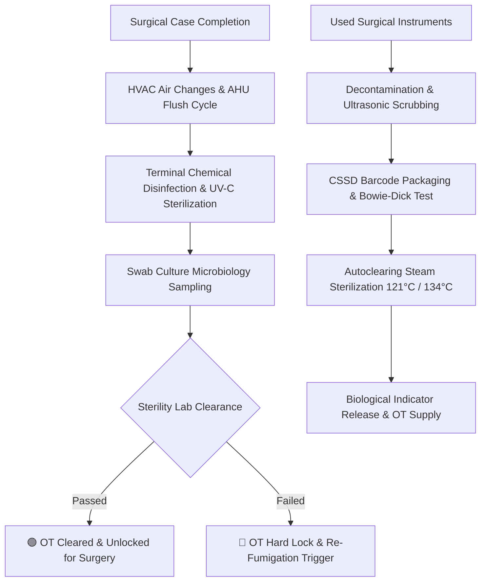

# Chapter 7: OT Sanitation, AHU/HEPA Telemetry & CSSD Sterilization

## 7.1 Operation Theatre Sanitation & Environmental Telemetry

The Operation Theatre Sanitation & Sterile Supply module governs surgical suite environmental hygiene, HVAC Air Handling Unit (AHU) telemetry, UV-C robotic sterilization, and Central Sterile Services Department (CSSD) autoclave tracking.

### 7.1.1 Laminar Airflow & Air Handling Unit (AHU / HEPA) Telemetry
- **Continuous HVAC / AHU Monitoring:** Real-time telemetry tracking operating room HVAC parameters:
  - **Positive Pressure Differential:** Maintains positive pressure ($\ge 15\text{ Pascals}$) relative to corridors to prevent airborne contaminant ingress.
  - **HEPA Filter Efficiency (0.3 μm):** Monitors differential pressure drops across High-Efficiency Particulate Air (HEPA) filters, triggering automated maintenance tickets on filter clogging.
  - **Air Changes Per Hour (ACPH):** Enforces minimum 20 air changes per hour (with at least 4 fresh air changes) for ultra-clean surgical suites.
  - **Climate Telemetry:** Logs temperature (18°C–21°C) and relative humidity (40%–60% RH) to prevent bacterial proliferation.

### 7.1.2 Terminal Cleaning, UV-C Sanitization & Microbiological Swab Clearance
- **Between-Case & Terminal Cleaning Checklists:** Digital sanitization checklists requiring environmental service team sign-off for floor scrubbing, surgical lamp wipe-downs, operating table sanitization, and anesthesia cart disinfection.
- **UV-C Automated Room Disinfection:** Logs automated UV-C robotic sterilization cycles, recording ultraviolet dose intensity ($mJ/cm^2$) and run duration.
- **Microbiological Air & Swab Culture Registry:** Tracks periodic microbiological settle-plate air cultures and surface swab tests (*Staphylococcus aureus, Pseudomonas aeruginosa, Aspergillus*).
- **Automated Infection Control Room Lock:** Automatically locks the physical OT scheduling board if a microbiological swab culture yields positive bacterial growth or if scheduled quarterly AHU validation expires, preventing surgery bookings until re-fumigation and sterile re-clearance.

---

## 7.2 Central Sterile Services Department (CSSD) & Autoclave Management

### 7.2.1 Surgical Instrument Decontamination & Pack Assembly
- **Decontamination & Ultrasonic Washer Tracking:** Tracks dirty instrument tray collection from OT, manual pre-soak, automated ultrasonic washer cycles, and thermal disinfection (90°C).
- **Barcode Instrument Pack Serialization:** Assembles surgical instrument sets (*e.g., Major Laparotomy Set, Orthopedic Drill Set*), wrapping in medical-grade sterile barrier paper and printing a barcoded CSSD Label capturing Pack ID, Assembly Date, Expiry Date, and Assembly Operator UHID.

### 7.2.2 Autoclave Validation & Biological Indicator Release
- **Steam & ETO Sterilization Cycles:** Integrates with Autoclave sterilizers monitoring cycle parameters (121°C for 20 mins or 134°C for 4 mins at 30 psi).
- **Chemical & Biological Indicator Verification:**
  - **Class 5 / Class 6 Chemical Integrators:** Scans internal chemical indicator strip color changes confirming steam penetration.
  - **Bowie-Dick Air Removal Test:** Mandatory daily morning vacuum check log for pre-vacuum autoclaves.
  - **Geobacillus stearothermophilus Biological Indicators (BI):** 24-hour rapid biological indicator incubator readout. Releases sterile load batches only upon negative BI spore growth confirmation.
- **Sterile Pack Inventory FEFO Distribution:** Tracks sterile store inventory with automated expiration alerts, blocking issuance of expired or un-cleared surgical sets to operating rooms.

---

## 7.3 Bio-Medical Waste (BMW) Management & CPCB Barcode Telemetry

### 7.3.1 Color-Coded Segregation & CPCB Compliance
- **4-Color Category Segregation Engine:** Enforces central Bio-Medical Waste Management Rules (CPCB Guidelines):
  - 🟡 **Yellow Bag (Infectious Anatomical & Solid Waste):** Human anatomical tissues, soiled dressings, expired drugs, blood bags.
  - 🔴 **Red Bag (Contaminated Recyclable Plastic):** Disposable tubing, IV bottles, catheters, urine bags, gloves.
  - ⚪ **White Container (Sharps Translucent Puncture-Proof):** Needles, scalpels, blades, fixed-needle syringes.
  - 🔵 **Blue Box/Pouch (Glassware & Metallic Implants):** Medicine vials, ampoules, glass slides, broken glassware.
- **Barcoded Waste Bag Tracking & Digital Weight Scale Interfacing:** Weighs color-coded waste bags on Bluetooth digital scales at ward collection points, generating barcoded CPCB stickers capturing Bag ID, Ward ID, Weight (kg), and Time.
- **CBWTF Dispatch & Manifest Generation:** Generates mandatory daily pickup manifests for Common Bio-Medical Waste Treatment Facility (CBWTF) pickup trucks with GPS vehicle tracking and digital receipt sign-off.
