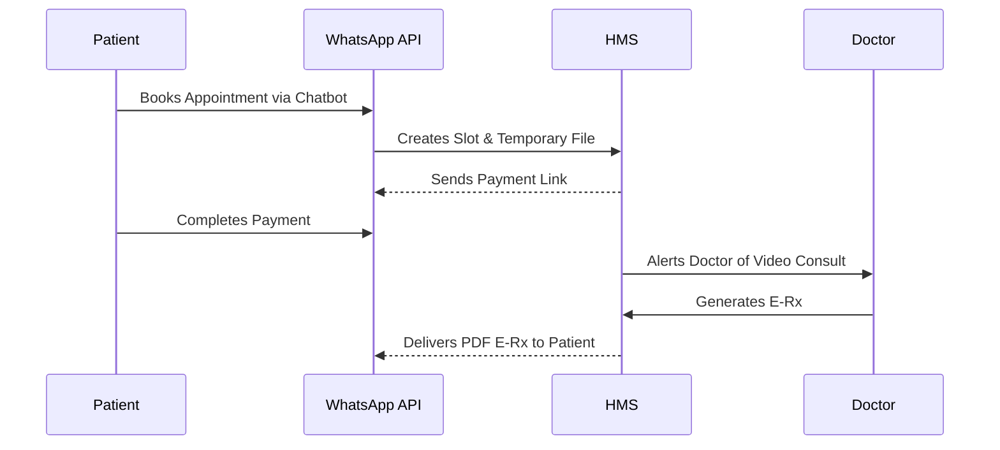

# Chapter 8: Medical Records Department (MRD) & Telemedicine

## 8.1 Overview

Maintaining compliance and continuity of care through digitized Medical Records and modern communication channels.

## 8.2 Medical Records Department (MRD)

The MRD module ensures the hospital adheres to national compliance standards for data retention, morbidity reporting, and legal auditing.

- **ICD-10/ICD-11 Coding:** Automated suggestions for diagnoses to ensure accurate morbidity and mortality reports.
- **File Tracking (Physical & Digital):** Barcode-based tracking for physical patient files borrowed by researchers or legal departments.
- **Archiving & Recycle Bin:** Secure archiving of old records with hard-delete prevention (soft delete to recycle bin) for compliance.

## 8.3 Telemedicine & WhatsApp Integration

Bringing healthcare to the patient's smartphone via native API integrations.

