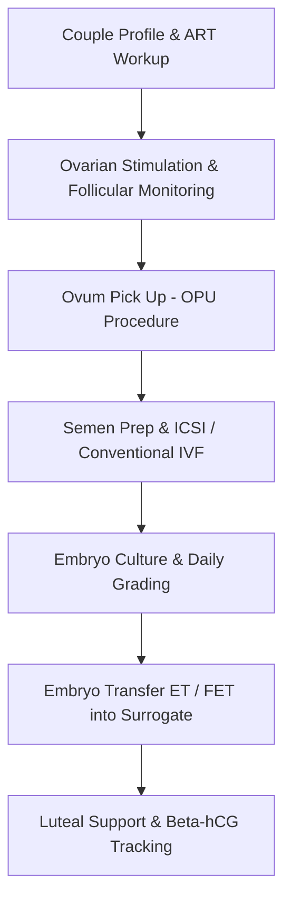

# Chapter 9: Gestational Surrogacy, IVF & ART Bio-Vault Operations

## 9.1 Surrogacy Act 2021 & ART Legal Compliance Vault

The IVF & ART Module governs Assisted Reproductive Technology (ART) and Gestational Surrogacy in strict compliance with the **Surrogacy (Regulation) Act 2021** and **ART (Regulation) Act 2021** (India).

### 9.1.1 Intended Couple Statutory Eligibility Verification
- **Statutory Age Limit Validation:** System blocks registration of intended couples unless age criteria are strictly met (Wife: 23–50 years, Husband: 26–55 years).
- **Certificate Vault:** Mandatory upload and digital verification of the **Certificate of Essentiality** (proving medical indication for surrogacy issued by District Medical Board) and **Certificate of Eligibility** issued by the Appropriate State Authority.

### 9.1.2 Surrogate Mother Registry & Altruistic Audit
- **Surrogate Eligibility Controls:** Verifies surrogate age (25–35 years), marital status, at least 1 living biological child, and restricts any woman from acting as a surrogate more than once in her lifetime.
- **Mandatory 36-Month Health Insurance Tracking:** Logs and tracks active 36-month health insurance coverage policies purchased for the surrogate mother covering post-partum complications.
- **Altruistic Compliance Audit Trail:** Maintains immutable financial audit logs confirming zero commercial payment or monetary transaction to the surrogate, enforcing strict legal compliance.

---

## 9.2 IVF & ART Clinical Lifecycle

### 9.2.1 Ovarian Stimulation & Follicular Growth Mapping
- **Gonadotropin Dosage Tracking:** Logs daily drug administration (FSH, HMG, GnRH antagonist/agonist dosages) alongside serum Estradiol ($E_2$) and Progesterone ($P_4$) levels.
- **Ultrasound Follicular Flowsheet:** Maps left and right ovary follicle diameters (mm) across stimulation Days 2, 6, 8, 10, 12 until HCG/Lupron ovulation trigger criteria ($\ge 3$ follicles $\ge 18\text{ mm}$) are met.

### 9.2.2 Ovum Pick Up (OPU) & Embryology Lab Logs
- **OPU Retrieval Breakdown:** OT procedure log capturing total oocytes retrieved and embryologist maturity breakdown:
  - **MII (Mature Metaphase II):** Suitable for ICSI micro-injection.
  - **MI (Metaphase I):** Immature oocytes.
  - **GV (Germinal Vesicle):** Severely immature oocytes.
- **ICSI & Fertilization Check:** Semen preparation logs (density gradient / swim-up recovery), ICSI micro-injection tracking, and Day 1 fertilization assessment (logging 2PN dual pronuclei presence).
- **Embryo Culture & Gardner Grading:** Daily grading of cleavage embryos (Day 3 cell count & fragmentation %) and Blastocysts (Day 5/6 Gardner grading e.g., *4AA, 3BB, 2CC* evaluating expansion, inner cell mass, and trophectoderm).

### 9.2.3 Embryo Transfer (ET / FET) & Pregnancy Confirmation
- **Transfer Logistics:** Tracks fresh vs. frozen embryo transfer (FET) into the Surrogate Mother's uterus, logging endometrial thickness (mm), triple-line pattern, catheter type, and video/image attachments of the transfer procedure.
- **Beta-hCG Monitoring:** Post-transfer luteal support logs, Day 14 quantitative Beta-hCG blood test monitoring, and fetal cardiac viability ultrasound scans at 6 weeks.

---

## 9.3 Specimen Cryo-Preservation Bank (-196°C LN2 Storage)

- **4-Level LN2 Storage Hierarchy:**
  $$\text{LN2 Cryo Tank} \longrightarrow \text{Canister ID} \longrightarrow \text{Goblet / Visotube} \longrightarrow \text{Color-Coded Straw ID}$$
- **Anonymous Donor Registry & 180-Day Quarantine:** ISBT 128 Donor ID masking protecting donor identity. Enforces mandatory **180-day Transmissible Infection (TTI) quarantine** for frozen donor sperm samples before release for IUI/ICSI.
- **Vitrification & Thaw Recovery Logs:** Tracks freezing dates, cryoprotectant media, straw colors, specimen types (*Sperm, Oocytes, Cleavage Embryos, Blastocysts*), and post-thaw survival percentages.
