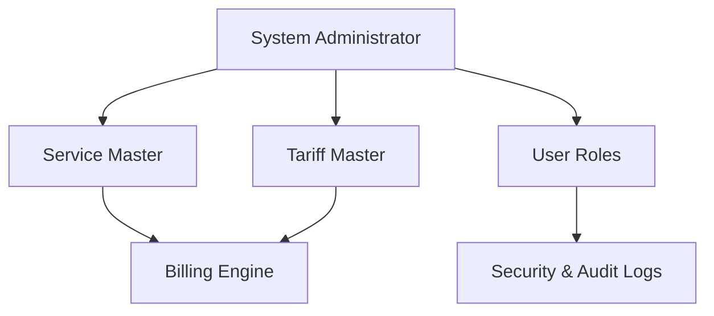

# Chapter 9: Configuration & Master Data Management

## 9.1 Overview

The Configuration module is the central nervous system of the HMS, allowing administrators to dictate the rules of the system without requiring code changes.

## 9.2 Master Data Architecture

Structured master tables prevent data duplication and ensure system-wide consistency.

### 9.2.1 Core Master Tables

- **Service Master:** Defining every billable item in the hospital (consultations, room rent, procedures, nursing charges) and linking them to specific departments.
- **Tariff & Corporate Rules:** Complex pricing engines where a single service (e.g., CBC Test) has dynamic pricing depending on the patient's ward (General vs ICU) or their TPA sponsor.
- **Role-Based Access Control (RBAC):** Granular permission matrices to define what a specific user (e.g., Junior Nurse vs Head Nurse) can view, edit, or delete.

