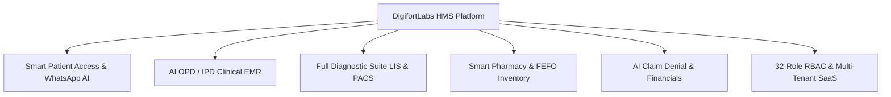
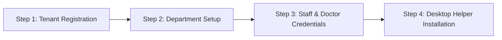

# DigifortLabs HMS - Enterprise Product Guide & Marketing Booklet

    <h1 style="color: #38bdf8; font-size: 2.8em; margin-bottom: 10px; border-bottom: none;">DigifortLabs HMS</h1>
    <h3 style="color: #94a3b8; font-size: 1.4em; font-weight: 400; margin-top: 0;">Next-Generation Hospital Management System & EMR Platform</h3>
    

        Empowering Hospitals, Clinics, and Multi-Specialty Networks with AI-Driven OPD/IPD Workflows, ABDM/ABHA Sync, Smart QMS, and NABH 5th Edition Compliance.
    

---

## 1. Executive Product Overview & Value Proposition

DigifortLabs HMS is a multi-tenant, cloud-native Healthcare Enterprise Resource Planning (ERP) platform designed for multi-specialty hospitals, diagnostic chains, and medical institutions. Built with cutting-edge web technology and strict adherence to Indian and international healthcare standards, DigifortLabs HMS eliminates revenue leakage, automates clinical documentation, and provides an unmatchable patient experience.

### Core Value Drivers:
* 🚀 **30-Second E-Prescribing**: Doctors generate structured OPD prescriptions, lab orders, and follow-up schedules in under 30 seconds using intelligent clinical templates.
* 🤖 **WhatsApp AI Patient Portal**: Zero-download patient engagement! Patients receive appointment tokens, lab reports, e-prescriptions, and payment receipts directly on WhatsApp.
* 🛡️ **100% Statutory Compliance**: Built-in automated engines for **NABH 5th Edition**, **ABDM/ABHA (M1/M2/M3)**, **PCPNDT Act 1994**, **MTP Act 2021**, **THOA Organ Transplant 1994**, and **DPDP Act 2023**.
* 💰 **35% Reduction in TPA Denial Rates**: Integrated GIPSA package auto-checker and AI claim denial predictor inspects billing items before submission to insurance companies.
* ⚡ **Hardware Integration Ready**: Native desktop protocol handlers for WhatsApp Web automation (`digifort-wa://`), TWAIN document scanners, and laboratory analyzer machine serial links (ASTM E1381 / HL7).

---

## 2. Comprehensive Module Feature Showcase

### 2.1 Outpatient (OPD) & Smart Queue Management (QMS)
* **Smart QMS Kiosks**: Waiting area digital signage TV displays with live token calling and automated WhatsApp notifications (*"You are next in line for Dr. Smith"*).
* **CDSS Safety Engine**: Real-time allergy warnings, drug-drug interaction alerts, and pediatric weight-based dosage auto-calculators.
* **Specialty OPD Charts**: Customized clinical interfaces for Cardiology, Pediatrics, Ophthalmology (refraction charts), Orthopedics, Dental (32-tooth chart), and ENT (Audiometry decibel graphs).

### 2.2 Inpatient (IPD), Ward & ICU Management
* **Visual Interactive Bed Matrix**: Color-coded ward grid displaying real-time bed status (*Vacant, Occupied, Under Cleaning, Reserved, Isolation*).
* **Nursing eMAR**: Barcode patient wristband verification ensuring zero medication administration errors at the bedside.
* **ICU Vitals Telemetry**: Continuous hour-by-hour vital sign recording with automated alert escalation for critical SpO2, BP, or cardiac deviations.

### 2.3 Surgery, Operation Theatre (OT) & High-Value RFID Implants
* **OT Scheduling & PAC**: Pre-Anesthesia Clearance workflow with WHO Surgical Safety Checklist hard locks.
* **High-Value Implant Barcode/RFID Tracking**: Trace expensive cardiac stents and orthopedic implants from vendor batch to patient surgical invoice with 100% audit accuracy.

### 2.4 Diagnostics: LIS & RIS/PACS
* **Pathology LIS**: ASTM E1381 / HL7 bi-directional analyzer machine interfacing, Westgard 6-Sigma quality control rules, and instant panic value SMS/WhatsApp alerts.
* **Diagnostic RIS/PACS**: DICOM 3.0 Modality Worklist (MWL) integration, zero-footprint Web PACS viewer, and radiologist AI dictation co-pilot.
* **Blood Bank (ISBT 128)**: DIN barcode tracking, mandatory 5-TTI infection screening lock, and donor cross-matching.

### 2.5 Pharmacy POS & FEFO Supply Chain
* **Multi-Store Inventory**: Central pharmacy store supplying sub-pharmacies, ward emergency boxes, and OT stores with FEFO (First-Expiry, First-Out) picking rules.
* **Narcotics Vault**: Quadruple-check digital sign-off and serial tracking for restricted habit-forming medications.

### 2.6 Financial Accounting & Insurance (TPA)
* **GIPSA Package Auto-Posting**: Instant package billing breakdown separating covered TPA items from non-covered out-of-pocket room upgrades.
* **Patient E-Wallet Ledger**: Prepaid deposit accounts supporting instant swiping at pharmacy, lab, and billing desks.

---

## 3. How to Register & Onboard Your Hospital

Getting started with DigifortLabs HMS is fast, simple, and can be completed in **4 easy steps**:

### Step 1: Register Your Hospital Account (Tenant Provisioning)
1. Visit the DigifortLabs Registration Portal at `https://digifortlabs.com/register`.
2. Enter your **Hospital Name**, **Organization Type** (Single Clinic, Multi-Specialty Hospital, Diagnostic Chain), **Address**, and **Contact Information**.
3. Choose your desired custom subdomain (e.g., `cityhospital.digifortlabs.com`).
4. System automatically provisions your isolated cloud database and sends your **Super Admin Credentials** via encrypted email and SMS.

### Step 2: Configure Departments & Tariff Masters
1. Log in as **Super Admin** or **Hospital Admin**.
2. Navigate to **Master Configurations $\rightarrow$ Hospital Departments**.
3. Activate the departments operating in your facility (e.g., General Medicine, OPD, IPD, Surgery OT, LIS Lab, Pharmacy, Radiology).
4. Upload or enter your **Service Tariffs**, **Bed Category Rates** (General Ward, Deluxe, ICU), and **Consultation Fees**.

### Step 3: Onboard Doctors, Nurses & Staff Members
1. Go to **User Management $\rightarrow$ Create User**.
2. Input staff details: Full Name, Council Registration Number (for Doctors), Mobile Number, and Email.
3. Assign the exact **Role-Based Access (RBAC)**:
   * `DOCTOR_OPD` / `DOCTOR_IPD` / `DOCTOR_BOTH`
   * `NURSE_IPD` / `RECEPTION_STAFF`
   * `PHARMACIST` / `ACCOUNT_STAFF` / `MRD_STAFF`
4. The staff member receives an automated WhatsApp login link with temporary PIN activation.

### Step 4: Install Desktop Tools & Scanner Services (Optional)
1. Download the **Digifort Desktop Utility Pack** from `https://digifortlabs.com/downloads`.
2. Install `local_wa_sender` for local WhatsApp protocol handling (`digifort-wa://`).
3. Install `local_scanner` to enable direct one-click USB TWAIN document scanning into EMR charts.

---

## 4. How to Use: Daily Operational Workflows

### 4.1 For Reception & Registration Staff (OPD Patient Intake)
1. Open the **Registration Module**.
2. Scan the patient's **Aadhaar / ABHA QR Code** or enter their mobile number.
3. If new patient: Enter basic demographic details (Name, Age, Gender, Address).
4. Select the **Attending Doctor** and **Consultation Type**.
5. Click **Collect Fee & Print Token**. System generates an OPD Token (e.g., `T-014`) and sends a WhatsApp confirmation to the patient.

### 4.2 For OPD Doctors (Consultation & 30-Sec E-Rx)
1. Open the **Doctor OPD Dashboard**.
2. Click on the patient token from the live queue list.
3. Enter or select **Chief Complaints**, **Vitals**, and **Clinical Diagnosis** (auto-coded with ICD-10).
4. Type medication names in the search box; select dosage, frequency, and duration.
5. Click **Sign & Issue E-Rx**. The prescription is instantly printed or sent to the patient's WhatsApp!

### 4.3 For IPD Nurses (Ward & eMAR Medication Administration)
1. Open the **IPD Ward Bed Matrix**.
2. Click on a bed to view patient details, doctor notes, and prescribed vitals schedules.
3. To administer medication: Scan patient wristband barcode, match drug name/dosage on eMAR screen, and click **Confirm Administered**.

### 4.4 For Pharmacists (POS Dispensing & FEFO Stocking)
1. Open **Pharmacy POS**.
2. Enter patient UHID or OPD Token to fetch prescribed medications automatically.
3. System highlights the exact batch with the earliest expiry (FEFO).
4. Scan medicine barcode, collect payment, and click **Dispense & Print Invoice**.

---

## 5. Contact & Support Information

Ready to transform your healthcare facility with **DigifortLabs HMS**?

* 🌐 **Official Website**: [https://digifortlabs.com](https://digifortlabs.com)
* ✉️ **Sales & Inquiries**: info@digifortlabs.com
* 📞 **Direct Contact / WhatsApp**: +91 81416 69879 (Rahul) | +91 97257 90563 (Keval)
* 🏢 **Headquarters**: Vapi, District Valsad, Gujarat, India
